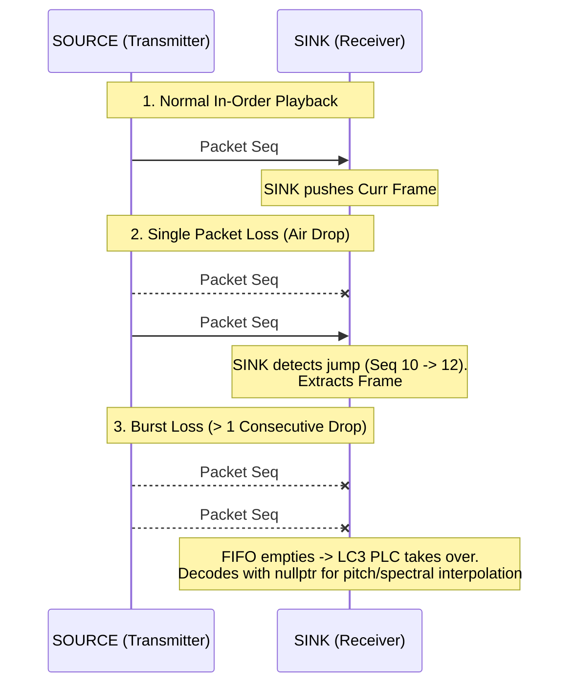

# VSAF Audio Transport Protocol Specification
**Document Version:** 2.1  
**Target:** ESP-NOW Layer-2 Broadcast (ESP32-S3 / ESP32-C6 / ESP32)  
**Audio Codec:** LC3 (Low Complexity Communication Codec - Bluetooth LE Audio standard)

---

## 1. Overview & Architectural Goals

The **Vendor-Specific Action Frame (VSAF) Audio Protocol** is a high-performance, low-latency broadcast audio transport layer implemented directly over IEEE 802.11 (Wi-Fi) management action frames ("ESP-NOW").

### Key Protocol Attributes
1. **Layer-2 Broadcast**: Bypasses IPv4/UDP/TCP network stack overhead, ARP handshakes, DHCP negotiation, and 802.11 association/authentication state machines.
2. **Deterministic Isochronous Cadence**: Operates on a strict 10.0 ms (or 7.5 ms) microsecond-pacing loop powered by 64-bit hardware timers (`esp_timer_get_time()`).
3. **In-Band Dual-Frame Redundancy**: Transmits both the current frame ($N$) and the previous frame ($N-1$) in every packet for zero-latency, click-free single packet loss recovery.
4. **32-Bit Word Alignment**: Enforces strict 4-byte boundaries across all header fields and payload boundaries for single-cycle RISC-V/Xtensa memory access.
5. **Cross-Node Microsecond Time Synchronization**: Embeds a 32-bit presentation timestamp (`pts_us`) and correlates it with receiver-side PHY baseband hardware timestamps (`rx_ctrl->timestamp`) for sub-sample stereo phase alignment.

---

## 2. Layer-1 & Layer-2 IEEE 802.11 Encapsulation

ESP-NOW audio packets are encapsulated within standard IEEE 802.11 Vendor-Specific Action Frames (Category `127` / `0x7F`).

### 2.1 Complete Over-the-Air (OTA) Frame Structure

```
+---------------------------------------------------------------------------------------------------+
|                                     IEEE 802.11 PHY LAYER                                         |
|  [Preamble & Sync]  |  [PLCP Header]  |  [12 Mbps OFDM Payload Modulation]                        |
+---------------------------------------------------------------------------------------------------+
|                                  IEEE 802.11 MAC LAYER (24 Bytes)                                 |
|  Frame Control | Duration |   RA (6B)   |   TA (6B)   |  BSSID (6B)  |  Seq Control (2B: Frag+Seq)|
|     (2 Bytes)  | (2 Bytes)| (Broadcast) | (Source MAC)| (Broadcast)  |    (12-bit MAC Counter)    |
+---------------------------------------------------------------------------------------------------+
|                               802.11 ACTION FRAME HEADER (5 Bytes)                                |
|  Category Code: 0x7F (Vendor-Specific) | Vendor OUI: 0x18, 0xFE, 0x34 (Espressif) | Type: 0x04    |
+---------------------------------------------------------------------------------------------------+
|                                    VSAF AUDIO CONTAINER (8 Bytes)                                 |
|  Magic (2B): 0x1337 | Seq (1B): 0..255 | Config (1B): Bitfield | PTS (4B): Microsecond Timestamp  |
+---------------------------------------------------------------------------------------------------+
|                                    VSAF AUDIO PAYLOAD (2N Bytes)                                  |
|  Primary Frame N (N Bytes, 32-bit aligned)  |  Redundant Frame N-1 (N Bytes, 32-bit aligned)      |
+---------------------------------------------------------------------------------------------------+
|                                       MAC LAYER FCS (4 Bytes)                                     |
|  CRC-32 Frame Check Sequence (Verified by Hardware Baseband)                                      |
+---------------------------------------------------------------------------------------------------+
```

### 2.2 IEEE 802.11 MAC Header Fields

| Field | Size | Description |
| :--- | :--- | :--- |
| **Frame Control** | 2 Bytes | Type: Management (`00b`), Subtype: Action (`1101b`). |
| **Duration / ID** | 2 Bytes | Set to 0 for broadcast frames. |
| **Address 1 (RA)** | 6 Bytes | Destination MAC: Broadcast `FF:FF:FF:FF:FF:FF` (or SINK Unicast MAC). |
| **Address 2 (TA)** | 6 Bytes | Transmitter MAC: Source dongle hardware MAC address. |
| **Address 3 (BSSID)** | 6 Bytes | Broadcast BSSID `FF:FF:FF:FF:FF:FF`. |
| **Sequence Control** | 2 Bytes | **4-bit Fragment Number** (`0`) + **12-bit MAC Sequence Counter** ($0\dots 4095$). Automatically incremented by the 802.11 radio transmitter hardware. |
| **Category** | 1 Byte | `0x7F` (Vendor-Specific Action Frame according to IEEE 802.11-2016 Clause 9.3.3.4). |
| **Vendor OUI** | 3 Bytes | Espressif OUI: `18:FE:34`. |
| **Vendor Type** | 1 Byte | ESP-NOW Protocol Type ID (`0x04`). |

---

## 3. Time Synchronization: 802.11 TSF vs. VSAF `pts_us`

### 3.1 Why Action Frames Lack Standard 802.11 TSF Timestamps
In conventional Wi-Fi infrastructure (Access Point $\leftrightarrow$ Station):
- The AP transmits an 8-byte (64-bit microsecond) **TSF (Timing Synchronization Function)** timestamp inside every **Beacon** and **Probe Response** frame.
- Station hardware automatically synchronizes its local MAC TSF timer to the AP clock upon Beacon arrival.
- **Action Frames (including ESP-NOW)** do **not** contain a standard TSF field in the 802.11 MAC header.

To achieve microsecond synchronization in connectionless broadcast mode without Beacons, the **`pts_us`** field is embedded directly in the 8-byte VSAF container header.

### 3.2 Hardware PHY Reception Metadata (`wifi_pkt_rx_ctrl_t`)
On the receiver side, ESP-IDF provides low-level radio metadata captured by the Wi-Fi baseband hardware upon frame arrival (`esp_now_recv_info_t->rx_ctrl`):

| Struct Member | Type | Unit / Range | Description |
| :--- | :--- | :--- | :--- |
| **`timestamp`** | `uint32_t` | Microseconds | **Hardware Baseband Ingress Timestamp**. Captured by the Wi-Fi MAC the exact instant the physical preamble arrived over the air. Bypasses FreeRTOS interrupt and task scheduling latency. |
| **`rssi`** | `int8_t` | dBm ($-127\dots 0$) | Received signal strength indication for RF link quality monitoring. |
| **`rate`** | `uint8_t` | Rate Code | Physical modulation rate (e.g. `0x0B` = 12 Mbps OFDM). |
| **`noise_floor`** | `int8_t` | dBm | Radio frequency noise floor measured at the antenna. |
| **`channel`** | `uint8_t` | $1\dots 14$ | Primary 2.4 GHz RF operating channel. |

### 3.3 Microsecond Clock Synchronization Loop
1. **Offset Calculation**: SINK computes the instant clock difference:
   $$\Delta_{master} = 	ext{PTS} - T_{local}$$
2. **Jitter Rejection Filter**: An exponential moving average filter ($lpha = 1/16$) reduces airtime jitter variance to within $\pm 25\,\mu	ext{s}$ over 4–5 frames.
3. **Playout Phase Release**: The SINK starts I2S hardware clocks (`m_i2s_dac->start()`) when local time matches $T_{start\_local} = 	ext{PTS}_0 + D_{presentation} - \Delta_{master}$.
4. **Continuous PLL**: During live streaming, phase drift is tracked and disciplined by $\pm 1$ sample fine-tuning ($20.8\,\mu	ext{s}$ at 48 kHz) to prevent Left and Right channels from drifting out of phase.

---

## 4. VSAF Protocol Structure & Word Alignment

### 4.1 Packet Layout

```
 0                   1                   2                   3
 0 1 2 3 4 5 6 7 8 9 0 1 2 3 4 5 6 7 8 9 0 1 2 3 4 5 6 7 8 9 0 1
+-+-+-+-+-+-+-+-+-+-+-+-+-+-+-+-+-+-+-+-+-+-+-+-+-+-+-+-+-+-+-+-+
|          magic (0x1337)       |      seq      |      cfg      |
+-+-+-+-+-+-+-+-+-+-+-+-+-+-+-+-+-+-+-+-+-+-+-+-+-+-+-+-+-+-+-+-+
|                            pts_us                             |
+-+-+-+-+-+-+-+-+-+-+-+-+-+-+-+-+-+-+-+-+-+-+-+-+-+-+-+-+-+-+-+-+
|                                                               |
|                 curr_frame (Primary Frame N)                  |
|                 Length: N Octets (Multiple of 4)              |
|                                                               |
+-+-+-+-+-+-+-+-+-+-+-+-+-+-+-+-+-+-+-+-+-+-+-+-+-+-+-+-+-+-+-+-+
|                                                               |
|                prev_frame (Redundant Frame N-1)               |
|                 Length: N Octets (Multiple of 4)              |
|                                                               |
+-+-+-+-+-+-+-+-+-+-+-+-+-+-+-+-+-+-+-+-+-+-+-+-+-+-+-+-+-+-+-+-+
```

### 4.2 Header Fields Specification

| Byte Offset | Field Name | Data Type | Size | Alignment | Description |
| :--- | :--- | :--- | :--- | :--- | :--- |
| `0..1` | `magic` | `uint16_t` | 2 Bytes | 16-bit | **VSAF Protocol Identifier** (`0x1337`). Discards foreign Wi-Fi and non-audio ESP-NOW traffic. |
| `2` | `seq` | `uint8_t` | 1 Byte | 8-bit | **Packet Sequence Counter** (`0..255`). Increments on each transmit cycle; detects dropped frames. |
| `3` | `cfg` | `uint8_t` | 1 Byte | 8-bit | **Configuration Bitfield**:<br/>- **Bits 0..2**: `ch_id` ($0 = 	ext{Left}$, $1 = 	ext{Right}$, $2..7 = 	ext{Aux}$)<br/>- **Bits 3..5**: `sr_code` ($0=8	ext{k}, 1=16	ext{k}, 2=24	ext{k}, 3=32	ext{k}, 4=48	ext{k}, 5=96	ext{k}$)<br/>- **Bit 6**: `dur_bit` ($0 = 10.0	ext{ ms}, 1 = 7.5	ext{ ms}$)<br/>- **Bit 7**: `sync_flag` (Master clock sync pulse) |
| `4..7` | `pts_us` | `uint32_t` | 4 Bytes | **32-bit** | **Presentation Timestamp (PTS)**. Microsecond hardware timestamp when audio was sampled (`esp_timer_get_time()`). Rolls over every ~71.58 minutes. |
| `8 .. 8+N-1` | `curr_frame` | `uint8_t[N]` | $N$ Bytes | **32-bit** | **Primary Frame N**. The current LC3 compressed frame to be decoded and played. |
| `8+N .. 8+2N-1` | `prev_frame` | `uint8_t[N]` | $N$ Bytes | **32-bit** | **Redundant Frame N-1**. Exact copy of the previous cycle's frame ($PTS - 	ext{Duration}$) for zero-latency single packet loss recovery. |

---

## 5. 32-Bit Word Alignment Rules

To maintain high memory throughput and avoid unaligned memory access penalties on RISC-V (ESP32-C6) and Xtensa (ESP32-S3):

1. **Header Alignment**: `VSAF_HEADER_LEN = 8` bytes $
ightarrow$ guarantees `curr_frame` starts at a **32-bit word boundary** (offset 8).
2. **Multiples of 4 Bytes**: $N$ (single-frame octet count) is strictly constrained to **multiples of 4 bytes** ($N \pmod 4 = 0$).
   - `prev_frame` starts at offset $8 + N$.
   - Because 8 is divisible by 4, and $N$ is divisible by 4, **`prev_frame` is guaranteed to be 32-bit word-aligned** in SRAM.
3. **Benefits**:
   - Enables single-cycle 32-bit word loads/stores (`lw`/`sw` on RISC-V, `l32i`/`s32i` on Xtensa).
   - Direct compatibility with LC3 bitstream readers which consume data in 32-bit chunks.
   - Zero-copy DMA buffer slicing.

---

## 6. Standard 8 kHz Sample Rate Grid

In accordance with the **Bluetooth LE Audio (BAP / LC3)** core specification, VSAF standardizes strictly on the 8 kHz integer clock grid:

| Code (`Bits 5..3`) | Sample Rate | Samples @ 10.0 ms | Samples @ 7.5 ms | Standard & Application |
| :---: | :---: | :---: | :---: | :--- |
| **`0`** (`000b`) | **8 kHz** | 80 samples | 60 samples | Ultra-low bandwidth speech / Telephony |
| **`1`** (`001b`) | **16 kHz** | 160 samples | 120 samples | Wideband voice (mSBC / HFP equivalent) |
| **`2`** (`010b`) | **24 kHz** | 240 samples | 180 samples | Super-wideband speech |
| **`3`** (`011b`) | **32 kHz** | 320 samples | 240 samples | Standard broadcast audio |
| **`4`** (`100b`) | **48 kHz** | 480 samples | 360 samples | High-Fidelity Studio Music (Default) |
| **`5`** (`101b`) | **96 kHz** | 960 samples | 720 samples | High-Resolution Audio |
| **`6 .. 7`** | *Reserved* | - | - | Future expansion |

#### Why 44.1 kHz is Omitted:
- **Fractional Framing on 7.5 ms**: $44100 	imes 0.0075 = \mathbf{330.75}$ samples. Fractional samples require multi-frame dithering or cause 100 samples/sec clock drift.
- **Odd Sample Count on 10.0 ms**: $44100 	imes 0.010 = \mathbf{441}$ samples. 441 is odd (not divisible by 2 or 4), breaking 32-bit DMA alignment and stereo interleaving.
- **LE Audio Compliance**: Bluetooth SIG BAP explicitly excludes 44.1 kHz to eliminate clock domain conversions.

---

## 7. C/C++ Header Definitions

```cpp
// 8-Byte Word-Aligned VSAF Header
struct EspNowAudioHeader {
    uint16_t magic;          // 0x1337 (Offsets 0..1, 16-bit aligned)
    uint8_t  seq;            // Sequence counter 0..255 (Offset 2)
    uint8_t  cfg;            // [0..2: ch_id 0..7] [3..5: sr_code] [6: 0=10ms/1=7.5ms] [7: sync] (Offset 3)
    uint32_t pts_us;         // 32-bit Microsecond Presentation Timestamp (Offsets 4..7, 32-bit aligned)
} __attribute__((packed));

// Dynamic VSAF Packet Buffer Definition
static constexpr size_t VSAF_HEADER_LEN = 8;
static constexpr size_t MAX_LC3_FRAME_OCTETS = 120;

// Maximum size: 8 + 2 * 120 = 248 bytes (32-bit aligned)
struct EspNowAudioPacket {
    EspNowAudioHeader hdr;
    uint8_t  curr_frame[MAX_LC3_FRAME_OCTETS];
    uint8_t  prev_frame[MAX_LC3_FRAME_OCTETS];
} __attribute__((packed));
```

---

## 8. Dynamic Bitrate, Frame Size & Bandwidth Matrix

| Frame Octets ($N$) | Bitrate @ 10.0 ms | Bitrate @ 7.5 ms | Total VSAF Packet ($8 + 2N$) | Audio Bandwidth (Stereo) | Recommended Profile |
| :---: | :---: | :---: | :---: | :---: | :--- |
| **20 Bytes** | **16.0 kbps** | 21.3 kbps | **48 Bytes** | 32 kbps | Ultra-Low Power / Weak RSSI Fallback |
| **40 Bytes** | **32.0 kbps** | 42.7 kbps | **88 Bytes** | 64 kbps | Speech / Low-Bandwidth Voice |
| **60 Bytes** | **48.0 kbps** | 64.0 kbps | **128 Bytes** | 96 kbps | Standard Efficiency Audio |
| **80 Bytes** | **64.0 kbps** | 85.3 kbps | **168 Bytes** | 128 kbps | High-Quality Music |
| **100 Bytes** | **80.0 kbps** | 106.7 kbps | **208 Bytes** | 160 kbps | Very High Fidelity Music |
| **120 Bytes** | **96.0 kbps** | **128.0 kbps** | **248 Bytes** | 192 / 256 kbps | Studio-Grade Maximum Fidelity (Default) |

---

## 9. In-Band Packet Loss Recovery (PLC)



- **Tier 1 (In-Band Dual-Frame Recovery)**: Single lost packets are recovered with **100% mathematical fidelity** from the subsequent packet's `prev_frame` payload with **0 ms latency penalty** and zero synthesized distortion.
- **Tier 2 (Native LC3 PLC)**: Burst losses invoke the LC3 decoder's internal Packet Loss Concealment to smoothly extrapolate audio waveforms without clicks or pops.
- **Tier 3 (Watchdog Recovery)**: If $\ge 5$ consecutive frames are dropped ($\ge 50	ext{ ms}$ loss), the SINK enters `SCANNING` state, isolates I2S clocks, and pre-fills its jitter cushion upon signal re-acquisition.
