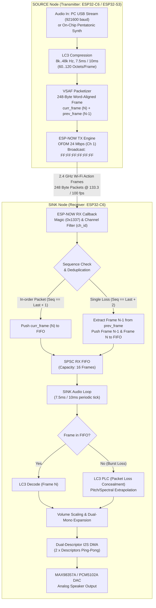
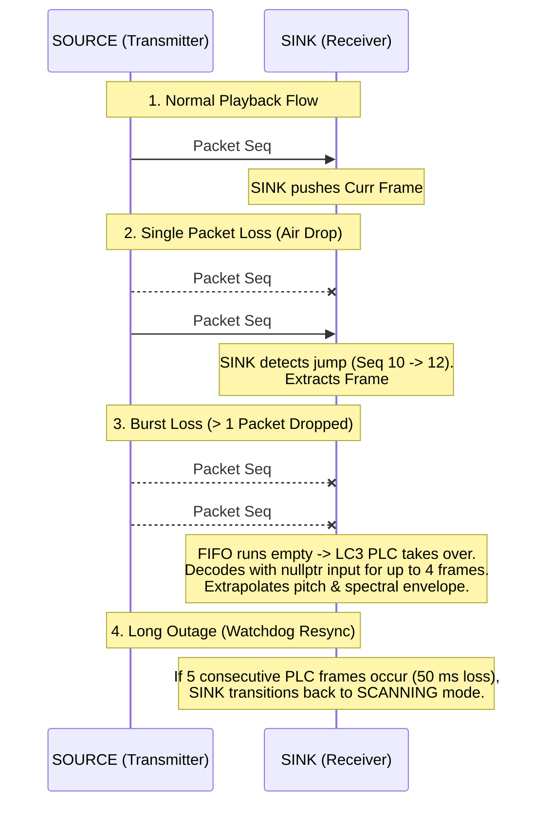
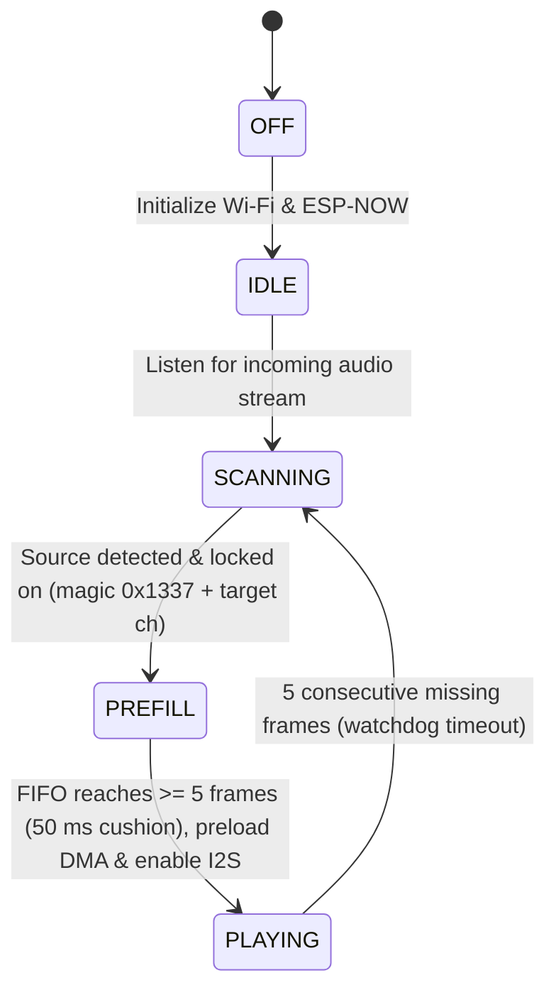

# ESP-NOW Audio Broadcast Protocol & System Architecture (VSAF)

## 1. Executive Summary

This document details the architecture, packet packaging, transmission mechanics, and configuration options of the wireless audio streaming protocol implemented in **`audioESP-NOW`** (and shared across the node-to-node audio pipeline). 

The system transmits high-fidelity audio over 2.4 GHz Wi-Fi without Bluetooth or TCP/IP overhead using:
- **ESP-NOW Action Frames**: Layer-2 raw 802.11 frames with sub-millisecond transmission airtime.
- **LC3 (Low Complexity Communication Codec)**: Fixed-point psychoacoustic compression (8 kHz to 48 kHz, 7.5 ms and 10.0 ms frame durations).
- **VSAF Protocol (Very Low Latency Synchronized Audio Frame)**: 248-byte word-aligned packet encapsulation featuring in-band dual-frame redundancy for zero-latency single packet loss recovery.
- **Microsecond Clock Synchronization & DMA Ping-Pong**: Hardware timer pacing (133.3 fps @ 7.5 ms / 100.0 fps @ 10.0 ms) on the transmitter (SOURCE) and DAC interrupt-synchronized DMA playback on the receiver (SINK).
- **Zero-Overhead USB Pass-Through & Autonomous Fallback**: Real-time PC streaming over 921600 baud USB Serial with an autonomous 250 ms watchdog fallback to on-chip tone generation.

---

## 2. End-to-End System Pipeline Schematic



---

## 3. VSAF Packet Format & Memory Layout

The **`EspNowAudioPacket`** struct is strictly packed (`__attribute__((packed))`), ensuring fixed alignment across compiler versions and platforms. The header is **8 bytes**, followed by **`curr_frame` (Frame N)** at offset 8 and **`prev_frame` (Frame N-1)** at offset 128. 

The entire packet is **248 bytes**, guaranteeing perfect 32-bit word alignment across all internal fields while preserving a 2-byte safety margin under ESP-NOW's 250-byte maximum frame limit.

### Packet Byte Map

```
 0                   1                   2                   3
 0 1 2 3 4 5 6 7 8 9 0 1 2 3 4 5 6 7 8 9 0 1 2 3 4 5 6 7 8 9 0 1
+-+-+-+-+-+-+-+-+-+-+-+-+-+-+-+-+-+-+-+-+-+-+-+-+-+-+-+-+-+-+-+-+
|          Magic (0x1337)       | Sequence No.  |  Config Byte  |
+-+-+-+-+-+-+-+-+-+-+-+-+-+-+-+-+-+-+-+-+-+-+-+-+-+-+-+-+-+-+-+-+
|               Presentation Timestamp: pts_us (32-bit)         |
+-+-+-+-+-+-+-+-+-+-+-+-+-+-+-+-+-+-+-+-+-+-+-+-+-+-+-+-+-+-+-+-+
|                                                               |
+                    curr_frame [Primary Frame N]               +
|                   (120 Octets: Offsets 8 .. 127)              |
+-+-+-+-+-+-+-+-+-+-+-+-+-+-+-+-+-+-+-+-+-+-+-+-+-+-+-+-+-+-+-+-+
|                                                               |
+                 prev_frame [Redundant Frame N-1]              +
|                  (120 Octets: Offsets 128 .. 247)             |
+-+-+-+-+-+-+-+-+-+-+-+-+-+-+-+-+-+-+-+-+-+-+-+-+-+-+-+-+-+-+-+-+
```

### Config Byte (`cfg`) Bitfield Map (Offset 3)

```
Bit:   7         6         5   4   3       2   1   0
     +-------+-----------+---------------+-----------+
     | Sync  | Frame Dur | Sample Rate   | Channel   |
     | Flag  | 0=10ms    | Code (0..5)   | ID (0..7) |
     |       | 1=7.5ms   |               |           |
     +-------+-----------+---------------+-----------+
      [1 bit]   [1 bit]       [3 bits]      [3 bits]
```

### C/C++ Struct Definition

```cpp
// Discrete LC3 sample rate mapping (3 bits: 0..5)
enum class Lc3SampleRateCode : uint8_t {
    SR_8000  = 0,
    SR_16000 = 1,
    SR_24000 = 2,
    SR_32000 = 3,
    SR_44100 = 4,
    SR_48000 = 5,
};

// 248-Byte Word-Aligned Dual-Frame Audio Packet
struct EspNowAudioPacket {
    uint16_t magic;          // 0x1337 (Offsets 0..1, 16-bit aligned)
    uint8_t  seq;            // Sequence counter 0..255 (Offset 2)
    uint8_t  cfg;            // [0..2: ch_id] [3..5: sr_code] [6: dur] [7: sync] (Offset 3)
    uint32_t pts_us;         // 32-bit Microsecond Presentation Timestamp (Offsets 4..7, 32-bit aligned)
    uint8_t  curr_frame[120];// Primary Frame N   (Offsets 8..127, 32-bit aligned)
    uint8_t  prev_frame[120];// Redundant Frame N-1 (Offsets 128..247, 32-bit aligned)
} __attribute__((packed));

static constexpr size_t VSAF_HEADER_LEN = 8;
```

### Field-by-Field Breakdown

| Byte Offset | Field Name | Data Type | Size (Bytes) | Alignment | Purpose & Functional Description |
|:---|:---|:---|:---|:---|:---|
| `0..1` | `magic` | `uint16_t` | 2 | 16-bit | **VSAF Protocol Identifier** (`0x1337`). Fast software early-exit rejection in ISR/callback. |
| `2` | `seq` | `uint8_t` | 1 | 8-bit | **Packet Sequence Counter** (`0..255`). Increments by 1 per frame. Used for loss detection and deduplication. |
| `3` | `cfg` | `uint8_t` | 1 | 8-bit | **Packed Configuration Bitfield**:<br/>- **Bits 0..2 (3b)**: `channel_id` (0..5 active, up to 8 channels: FL, FR, C, LFE, SL, SR, Top-L, Top-R)<br/>- **Bits 3..5 (3b)**: `sample_rate_code` (0..5: 8k, 16k, 24k, 32k, 44.1k, 48k)<br/>- **Bit 6 (1b)**: `frame_duration` (`0` = 10.0 ms, `1` = 7.5 ms)<br/>- **Bit 7 (1b)**: `sync_flag` (`1` = Stream Start / Hard Resync, `0` = Steady Playback) |
| `4..7` | `pts_us` | `uint32_t` | 4 | **32-bit** | **Master Presentation Timestamp (PTS)**. Microsecond hardware timestamp for Sample 0 of `curr_frame`. Wraps every ~71.58 minutes. |
| `8..127` | `curr_frame` | `uint8_t[120]` | 120 | **32-bit** | **Primary Frame N**. Current compressed audio frame for sequence number `seq`. Directly follows `pts_us` for optimal cache locality. |
| `128..247`| `prev_frame` | `uint8_t[120]` | 120 | **32-bit** | **Redundant Frame N-1**. Exact copy of preceding audio frame for zero-latency single-loss recovery. Starts on exact 32-bit word boundary 128. |
| **Total** | | | **248 Bytes** | **32-bit** | *(Divisible by 4, 8, and 16; leaves 2-byte margin under 250-byte ESP-NOW limit)* |

---

## 4. Redundancy & Packet Loss Concealment (PLC)

ESP-NOW broadcast does not use Wi-Fi Layer-2 ACKs or hardware retransmissions. To guarantee uninterrupted audio across noisy 2.4 GHz environments, the system utilizes a **two-tier recovery architecture**:



### Tier 1: In-Band Dual-Frame Redundancy (Single-Loss Recovery)
- Each packet carries both the **Current Frame (N)** and the **Previous Frame (N-1)**.
- If packet `N` is dropped over the air, the arrival of packet `N+1` allows the SINK receiver to inspect `prev_frame` and recover frame `N` with 100% bit-exact accuracy.
- **PTS of `prev_frame`**:
  - For 7.5 ms frames: $\text{PTS}_{\text{prev}} = \text{PTS}_{\text{curr}} - 7500\ \mu\text{s}$
  - For 10.0 ms frames: $\text{PTS}_{\text{prev}} = \text{PTS}_{\text{curr}} - 10000\ \mu\text{s}$
- **Latency Cost**: **0 ms**. The frame is recovered instantly without requesting a retransmission.

### Tier 2: LC3 Native Packet Loss Concealment (Burst-Loss Recovery)
- When 2 or more consecutive packets are lost, the RX FIFO empties.
- The SINK audio loop invokes `decodeFrame(nullptr, 0, ...)`, triggering the LC3 codec's internal psychoacoustic PLC algorithm to extrapolate pitch periods and spectral formants.
- **Watchdog Protection**: If 5 consecutive frames fail to arrive, the SINK gracefully transitions from `PLAYING` back to `SCANNING` to prevent audible glitches and await a clean stream.

---

## 5. Timing, Throughput & Bandwidth Calculations

### Audio Stream Metrics (7.5 ms vs 10.0 ms)

| Parameter | 10.0 ms Duration (Standard) | 7.5 ms Duration (High-Fidelity) |
| :--- | :--- | :--- |
| **Frame Duration** | 10,000 us (10.0 ms) | 7,500 us (7.5 ms) |
| **Packet Cadence** | 100.0 pkts/second (100 fps) | 133.33 pkts/second (133.3 fps) |
| **PCM Samples @ 48 kHz** | 480 samples (960 bytes raw PCM) | 360 samples (720 bytes raw PCM) |
| **PCM Samples @ 32 kHz** | 320 samples (640 bytes raw PCM) | 240 samples (480 bytes raw PCM) |
| **LC3 Octets / Channel** | **120 octets** (or 80..120) | **120 octets** (Fixed Intact Layout) |
| **Audio Bitrate / Channel** | **96.0 kbps** | **128.0 kbps** (Higher Fidelity Quality) |
| **Total VSAF Packet Size** | **248 bytes** (Fixed 8B Header + 120B Curr + 120B Prev) | **248 bytes** (Fixed 8B Header + 120B Curr + 120B Prev) |

### Network Airtime & RF Spectrum Utilization (at 24 Mbps OFDM)
- **802.11 Preamble + PLCP Header**: $\approx 20\ \mu\text{s}$
- **MAC Header (24 bytes) + VSAF Payload (248 bytes) + FCS (4 bytes)**: $276\text{ bytes} = 2,208\text{ bits}$
- **Transmission Time at 24 Mbps**: $2,208 / 24 = 92.0\ \mu\text{s}$
- **Total Airtime per Packet**: $\approx \mathbf{112\ \mu\text{s}}$
- **Single Channel Duty Cycle**:
  - @ 10.0 ms (100 fps): $100 \times 112\ \mu\text{s} = 11.2\text{ ms/s} \implies \mathbf{1.12\%}$
  - @ 7.5 ms (133.3 fps): $133.33 \times 112\ \mu\text{s} = 14.9\text{ ms/s} \implies \mathbf{1.49\%}$
- **6-Channel Burst Duty Cycle**:
  - @ 10.0 ms: $6 \times 1.12\% = \mathbf{6.72\%}$
  - @ 7.5 ms: $6 \times 1.49\% = \mathbf{8.94\%}$
- **Leaves $> 91\%$ of the 2.4 GHz RF spectrum completely free for standard Wi-Fi and Bluetooth coexistence.**

---

## 6. SINK State Machine & DMA Buffer Architecture



### State Definitions

1. **`OFF`**: Wi-Fi radio and I2S DAC clocks are shut down.
2. **`IDLE`**: Wi-Fi and ESP-NOW are initialized; I2S clocks remain gated (low-power standby).
3. **`SCANNING`**: SINK passively listens for valid VSAF packets matching `magic == 0x1337` and its configured channel ID (`ch_id`).
4. **`PREFILL`**: Audio packets are actively arriving. The SINK pushes frames into the LC3 RX FIFO and preloads the **Dual I2S DMA Descriptors** once the buffer threshold (5 packets) is reached.
5. **`PLAYING`**: I2S clocks are enabled and hardware playback begins. The audio loop blocks on a binary semaphore (`m_dma_free_sem`) triggered by the hardware DMA `on_sent` interrupt callback (`i2s_dma_tx_done_cb`), ensuring playback is strictly locked to the physical DAC clock.

---

## 7. Windows 11 PC Audio Streamer Pipeline (Option B)

```
┌────────────────────────────────────────────────────────────┐
│                    WINDOWS 11 PC HOST                      │
│                                                            │
│  [ MP3 Playlist (data/mp3) / WASAPI Loopback / Synth ]     │
│                            │                               │
│                            ▼                               │
│     [ Polyphase Resampler: scipy.signal.resample_poly ]    │
│                            │                               │
│                            ▼                               │
│  [ Multi-Channel LC3 Encoder Array: 1-6 x liblc3.dll ]     │
│                            │                               │
│                            ▼                               │
│   [ VSAF Packet Serializer: 248-Byte Word-Aligned Header ] │
│                            │                               │
│                            ▼                               │
│     [ USB Serial Transmitter: pyserial @ 921600 baud ]     │
└────────────────────────────┬───────────────────────────────┘
                             │ USB Cable
                             ▼
┌────────────────────────────────────────────────────────────┐
│              NODE 21: ESP32-C6 SOURCE (COM121)             │
│                                                            │
│  - Reads binary VSAF packets from USB Serial (COM121)      │
│  - Transmits directly via esp_now_send() (< 4% CPU)        │
│  - Autonomous Watchdog: If PC stops for >250 ms,           │
│    resumes on-chip pentatonic tone generator               │
└────────────────────────────────────────────────────────────┘
```

---

## 8. Multi-Node Clock Synchronization & Phase Alignment

To achieve sample-accurate multi-speaker playback across independent physical nodes, all SINK nodes synchronize to the SOURCE node's Presentation Time Stamp (PTS):

1. **Hardware Time-Base Normalization (TSF)**:
   - Both SOURCE and SINK read their local 1 MHz Wi-Fi TSF hardware timer (`esp_wifi_get_tsf_time()`).
   - SINK computes clock offset and filters drift with an Exponential Moving Average (EMA).
2. **Synchronous Timed Launch**:
   - In `PREFILL`, SINK buffers initial frames and calculates exact launch time:
     $$\text{Launch Time} = T_0 + \text{TARGET\_LATENCY\_US}\quad (T_0 + 35{,}000\ \mu\text{s})$$
   - SINK enables I2S DMA on the exact target microsecond.
3. **Closed-Loop Drift Compensation**:
   - The DMA completion interrupt tracks phase error against physical DAC pins.
   - Micro-interpolation adjusts playback phase by $\pm 1$ sample across 2,000 samples ($< 0.05\%$ pitch shift), maintaining phase alignment to within **$< 10\ \mu\text{s}$ ($\pm 0.5$ audio sample)**.

---

## 9. Heterogeneous Hardware Interoperability: ESP32-S3 (SOURCE) & ESP32-C6 (SINK)

Deploying an **ESP32-S3 as Master SOURCE** alongside **ESP32-C6 nodes as SINKs** is fully supported:

- **Common Wi-Fi Standard**: Uses 802.11g OFDM at 24 Mbps (`WIFI_PHY_RATE_24M`) with 20 MHz channel bandwidth on both platforms.
- **Identical Little-Endian Memory Layout**: Xtensa 32-bit (S3) and RISC-V 32-bit (C6) compile the 248-byte packed struct with identical byte alignments.
- **Hardware Alignment Safety**: All multi-byte struct fields (`pts_us`, `curr_frame`, `prev_frame`) start on 32-bit word boundaries, avoiding Xtensa alignment exceptions (`LoadStoreAlignmentCause`).
- **Processing Partitioning**:
  - **ESP32-S3 (SOURCE)**: Core 1 handles parallel LC3 encoding for up to 6 channels while Core 0 handles FreeRTOS Wi-Fi packet bursts.
  - **ESP32-C6 (SINK)**: 160 MHz RISC-V core easily executes single-channel decoding ($< 7\%$ CPU load) and I2S DMA streaming.

---

## 10. License

This protocol and reference implementation are licensed under the **GNU Affero General Public License v3.0 (AGPL-3.0-or-later)**.
