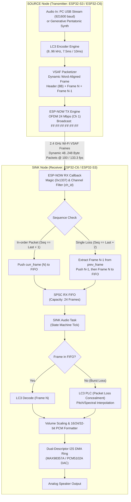
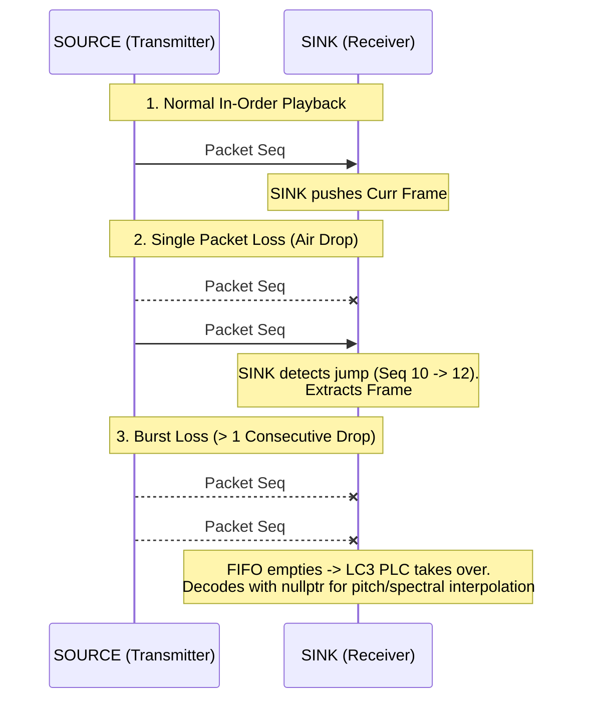

# ESP-NOW Audio Broadcast Protocol & System Architecture (VSAF)

## 1. Executive Summary

This document details the architecture, packet packaging, transmission mechanics, and configuration of the **Vendor-Specific Action Frame (VSAF)** audio broadcast protocol implemented in the `audioESP-NOW` firmware.

The system transmits high-fidelity audio over 2.4 GHz Wi-Fi without Bluetooth or TCP/IP overhead by combining:
- **ESP-NOW Action Frames (VSAF)**: Layer-2 raw 802.11 vendor-specific action frames with sub-millisecond transmission airtime (~112 us per packet at 24 Mbps OFDM).
- **LC3 (Low Complexity Communication Codec)**: Psychoacoustic compression (fixed-point on ESP32-C6 RISC-V, Google liblc3 with hardware FPU on ESP32-S3 Xtensa) operating across standard 8 kHz integer multiples (8, 16, 24, 32, 48, 96 kHz).
- **Dynamic VSAF Dual-Frame Payload**: Variable-length, 32-bit word-aligned packet architecture carrying both Primary Frame $N$ and Redundant Frame $N-1$ ($8 + 2 \times N$ bytes).
- **Microsecond Clock Synchronization**: Presentation Timestamps (`pts_us`) enabling sub-millisecond DAC clock phase alignment across independent Left/Right SINK nodes.
- **Dynamic On-the-Fly Reconfiguration**: Live bitrate (16..128 kbps), sample rate (8..96 kHz), frame duration (7.5 ms / 10.0 ms), and DAC bit depth (16/24/32-bit) changes without dropping connection state.

---

## 2. End-to-End System Pipeline Schematic



---

## 3. VSAF Packet Format & Memory Layout

The **Vendor-Specific Action Frame (VSAF)** audio packet consists of an **8-byte word-aligned header** followed by two contiguous LC3 frame payloads ($2 \times N$ octets).

The total packet length is **`8 + 2 * N` bytes**, where $N$ is the single-frame LC3 octet count ($N \in [20 .. 120]$).

```text
 0                   1                   2                   3
 0 1 2 3 4 5 6 7 8 9 0 1 2 3 4 5 6 7 8 9 0 1 2 3 4 5 6 7 8 9 0 1
+-+-+-+-+-+-+-+-+-+-+-+-+-+-+-+-+-+-+-+-+-+-+-+-+-+-+-+-+-+-+-+-+
|          Magic Word           |    Seq Num    | Config & Mode |  (Bytes 0..3)
|          (0x1337)             |    (0..255)   |   (Bitfield)  |
+-+-+-+-+-+-+-+-+-+-+-+-+-+-+-+-+-+-+-+-+-+-+-+-+-+-+-+-+-+-+-+-+
|              Presentation Timestamp (PTS in microseconds)     |  (Bytes 4..7)
+-+-+-+-+-+-+-+-+-+-+-+-+-+-+-+-+-+-+-+-+-+-+-+-+-+-+-+-+-+-+-+-+
|                                                               |
|             Primary LC3 Frame N (curr_frame: N bytes)         |  (Bytes 8 .. 8+N-1)
|                                                               |
+-+-+-+-+-+-+-+-+-+-+-+-+-+-+-+-+-+-+-+-+-+-+-+-+-+-+-+-+-+-+-+-+
|                                                               |
|          Redundant LC3 Frame N-1 (prev_frame: N bytes)        |  (Bytes 8+N .. 8+2N-1)
|                                                               |
+-+-+-+-+-+-+-+-+-+-+-+-+-+-+-+-+-+-+-+-+-+-+-+-+-+-+-+-+-+-+-+-+
```

### Config Byte (`cfg`) Bitfield Map (Offset 3)

```text
Bit:   7         6         5   4   3       2   1   0
     +-------+-----------+---------------+-----------+
     | Sync  | Frame Dur | Sample Rate   | Channel   |
     | Flag  | 0=10.0ms  | Code (0..5)   | ID (0..7) |
     |       | 1= 7.5ms  |               |           |
     +-------+-----------+---------------+-----------+
      [1 bit]   [1 bit]       [3 bits]      [3 bits]
```

### Field-by-Field Breakdown

| Byte Offset | Field Name | Data Type | Size | Alignment | Purpose & Functional Description |
| :--- | :--- | :--- | :--- | :--- | :--- |
| `0..1` | `magic` | `uint16_t` | 2 Bytes | 16-bit | **VSAF Protocol Identifier** (`0x1337`). Discards foreign Wi-Fi/ESP-NOW traffic. |
| `2` | `seq` | `uint8_t` | 1 Byte | 8-bit | **Packet Sequence Counter** (`0..255`). Increments on each transmit cycle; detects dropped frames. |
| `3` | `cfg` | `uint8_t` | 1 Byte | 8-bit | **Configuration Bitfield**:<br/>- **Bits 0..2**: `ch_id` ($0 = \text{Left}$, $1 = \text{Right}$, $2..7 = \text{Aux}$)<br/>- **Bits 3..5**: `sr_code` ($0=8\text{k}, 1=16\text{k}, 2=24\text{k}, 3=32\text{k}, 4=48\text{k}, 5=96\text{k}$)<br/>- **Bit 6**: `dur_bit` ($0 = 10.0\text{ ms}, 1 = 7.5\text{ ms}$)<br/>- **Bit 7**: `sync_flag` (Master clock sync pulse) |
| `4..7` | `pts_us` | `uint32_t` | 4 Bytes | **32-bit** | **Presentation Timestamp (PTS)**. Microsecond hardware timestamp when audio was sampled (`esp_timer_get_time()`). Used for sub-millisecond inter-node synchronization. |
| `8 .. 8+N-1` | `curr_frame` | `uint8_t[N]` | $N$ Bytes | **32-bit** | **Primary Frame N**. The current LC3 compressed frame to be decoded and played. |
| `8+N .. 8+2N-1` | `prev_frame` | `uint8_t[N]` | $N$ Bytes | **32-bit** | **Redundant Frame N-1**. Exact copy of the previous cycle's frame ($PTS - \text{Duration}$) for zero-latency single packet loss recovery. |

---

### 4. 32-Bit Word Alignment & Frame Length Rules

To maintain high memory throughput and avoid unaligned memory access penalties on RISC-V (ESP32-C6) and Xtensa (ESP32-S3), the protocol enforces:

1. **Header Alignment**: `VSAF_HEADER_LEN = 8` bytes $\rightarrow$ guarantees `curr_frame` starts at a **32-bit word boundary** (offset 8).
2. **Multiples of 4 Bytes**: $N$ (the single-frame octet count) is strictly constrained to **multiples of 4 bytes** ($N \pmod 4 = 0$).
   - `prev_frame` starts at offset $8 + N$.
   - Because 8 is divisible by 4, and $N$ is divisible by 4, **`prev_frame` is guaranteed to be 32-bit word-aligned** in SRAM.
3. **Benefits**:
   - Enables single-cycle 32-bit word loads/stores (`lw`/`sw` on RISC-V, `l32i`/`s32i` on Xtensa).
   - Direct compatibility with LC3 bitstream readers which consume data in 32-bit chunks.
   - Zero-copy DMA buffer slicing.

---

### 5. Standard 8 kHz Sample Rate Grid (44.1 kHz Omission Rationale)

In accordance with the **Bluetooth LE Audio (BAP / LC3)** core specification, VSAF standardizes strictly on the 8 kHz integer clock grid:

| Code (`Bits 5..3`) | Sample Rate | Samples @ 10.0 ms | Samples @ 7.5 ms | Standard & Application |
| :---: | :---: | :---: | :---: | :--- |
| **`0`** (`000b`) | **8 kHz** | 80 samples | 60 samples | Ultra-low bandwidth speech / Telephony |
| **`1`** (`001b`) | **16 kHz** | 160 samples | 120 samples | Wideband voice (mSBC / HFP equivalent) |
| **`2`** (`010b`) | **24 kHz** | 240 samples | 180 samples | Super-wideband speech |
| **`3`** (`011b`) | **32 kHz** | 320 samples | 240 samples | Standard broadcast audio (Default) |
| **`4`** (`100b`) | **48 kHz** | 480 samples | 360 samples | High-Fidelity Studio Music (Mandatory LE Audio) |
| **`5`** (`101b`) | **96 kHz** | 960 samples | 720 samples | High-Resolution Audio (Optional / Extended) |
| **`6 .. 7`** | *Reserved* | - | - | Future expansion |

#### Why 44.1 kHz is Omitted:
- **Fractional Framing on 7.5 ms**: $44100 \times 0.0075 = \mathbf{330.75}$ samples. Fractional samples require multi-frame dithering (331, 331, 330) or drop 0.75 samples/frame, causing 100 samples/sec drift.
- **Odd Sample Count on 10.0 ms**: $44100 \times 0.010 = \mathbf{441}$ samples. 441 is odd (not divisible by 2 or 4), breaking 32-bit DMA alignment and stereo interleaving.
- **LE Audio Compliance**: Bluetooth SIG BAP explicitly excludes 44.1 kHz to eliminate clock domain conversions across ISO channels.

---

### 6. C/C++ Header Definitions

```cpp
// 8-Byte Word-Aligned VSAF Header
struct EspNowAudioHeader {
    uint16_t magic;          // 0x1337 (Offsets 0..1, 16-bit aligned)
    uint8_t  seq;            // Sequence counter 0..255 (Offset 2)
    uint8_t  cfg;            // [0..2: ch_id 0..7] [3..5: sr_code] [6: 0=10ms/1=7.5ms] [7: sync] (Offset 3)
    uint32_t pts_us;         // 32-bit Microsecond Presentation Timestamp (Offsets 4..7, 32-bit aligned)
} __attribute__((packed));

// Dynamic VSAF Packet Buffer Definition
static constexpr size_t VSAF_HEADER_LEN = 8;
static constexpr size_t MAX_LC3_FRAME_OCTETS = 120;

// Maximum size: 8 + 2 * 120 = 248 bytes (32-bit aligned)
struct EspNowAudioPacket {
    EspNowAudioHeader hdr;
    uint8_t  curr_frame[MAX_LC3_FRAME_OCTETS];
    uint8_t  prev_frame[MAX_LC3_FRAME_OCTETS];
} __attribute__((packed));
```

#### Dynamic Receiver Extraction on SINK:

```cpp
void EspNowAudioBroadcast::onPacketReceived(const uint8_t* mac_addr, const uint8_t* data, int data_len, int8_t rssi, uint8_t rate) {
    if (data_len < static_cast<int>(VSAF_HEADER_LEN + 20)) return;

    const auto* hdr = reinterpret_cast<const EspNowAudioHeader*>(data);
    if (hdr->magic != m_active_magic) return;

    // Channel filtering (Ch 0 = Left, Ch 1 = Right)
    uint8_t pkt_ch = hdr->cfg & 0x07;
    if (pkt_ch != m_target_channel) return;

    // Dynamic frame length calculation from over-the-air payload size
    size_t payload_len = data_len - VSAF_HEADER_LEN;
    uint16_t frame_len = static_cast<uint16_t>(payload_len / 2);
    if (frame_len < 20 || frame_len > MAX_LC3_FRAME_OCTETS || (frame_len % 4) != 0) return;

    const uint8_t* curr_frame_ptr = data + VSAF_HEADER_LEN;
    const uint8_t* prev_frame_ptr = data + VSAF_HEADER_LEN + frame_len;

    // Push frames to FIFO and trigger SINK decoder...
}
```

---

### 7. Dynamic Bitrate, Frame Size & Bandwidth Matrix

| Frame Octets ($N$) | Bitrate @ 10.0 ms | Bitrate @ 7.5 ms | Total VSAF Packet ($8 + 2N$) | Audio Bandwidth (Stereo) | Recommended Profile |
| :---: | :---: | :---: | :---: | :---: | :--- |
| **20 Bytes** | **16.0 kbps** | 21.3 kbps | **48 Bytes** | 32 kbps | Ultra-Low Power / Weak RSSI Fallback |
| **40 Bytes** | **32.0 kbps** | 42.7 kbps | **88 Bytes** | 64 kbps | Speech / Low-Bandwidth Voice |
| **60 Bytes** | **48.0 kbps** | 64.0 kbps | **128 Bytes** | 96 kbps | Standard Efficiency Audio |
| **80 Bytes** | **64.0 kbps** | 85.3 kbps | **168 Bytes** | 128 kbps | High-Quality Music (Default) |
| **100 Bytes** | **80.0 kbps** | 106.7 kbps | **208 Bytes** | 160 kbps | Very High Fidelity Music |
| **120 Bytes** | **96.0 kbps** | **128.0 kbps** | **248 Bytes** | 192 / 256 kbps | Studio-Grade Maximum Fidelity |

---

### 8. In-Band Packet Loss Recovery (PLC)



- **Tier 1 (In-Band Dual-Frame Recovery)**: Single lost packets are recovered with **100% mathematical fidelity** from the subsequent packet's `prev_frame` payload with **0 ms latency penalty** and zero synthesized distortion.
- **Tier 2 (Native LC3 PLC)**: Burst losses invoke the LC3 decoder's internal Packet Loss Concealment to smoothly extrapolate audio waveforms without clicks or pops.
- **Tier 3 (Watchdog Recovery)**: If $\ge 5$ consecutive frames are dropped ($\ge 50\text{ ms}$ loss), the SINK gracefully enters `SCANNING` state, isolates I2S clocks, and pre-fills its jitter cushion upon signal re-acquisition.
