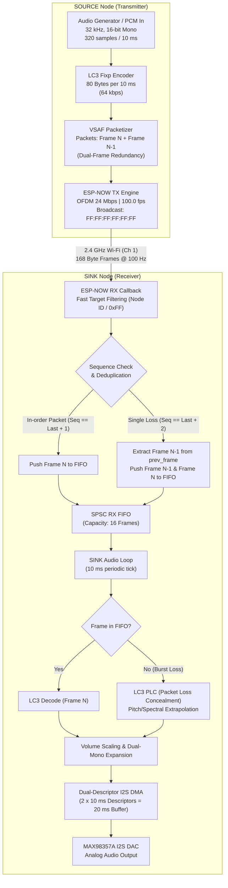
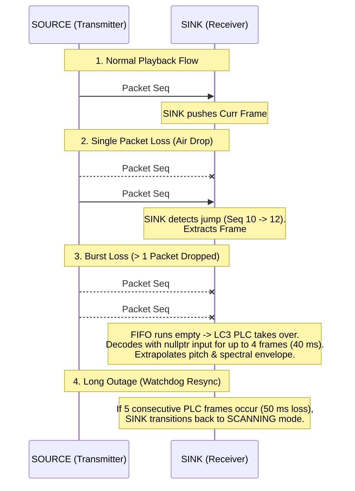
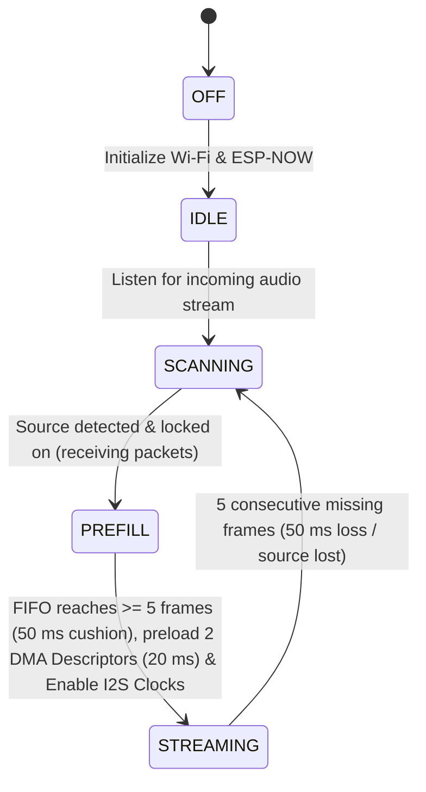
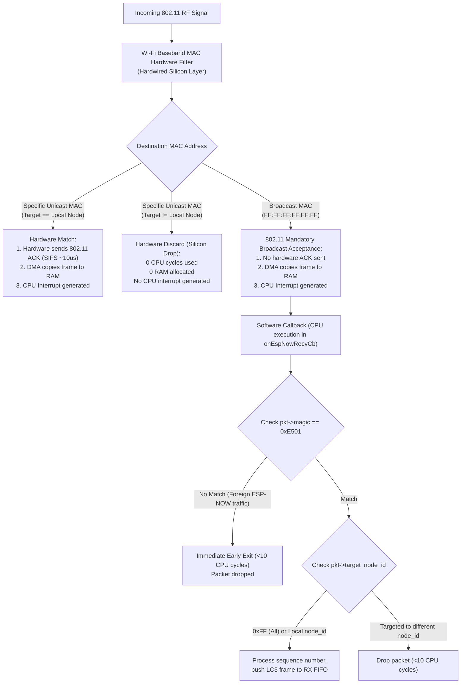
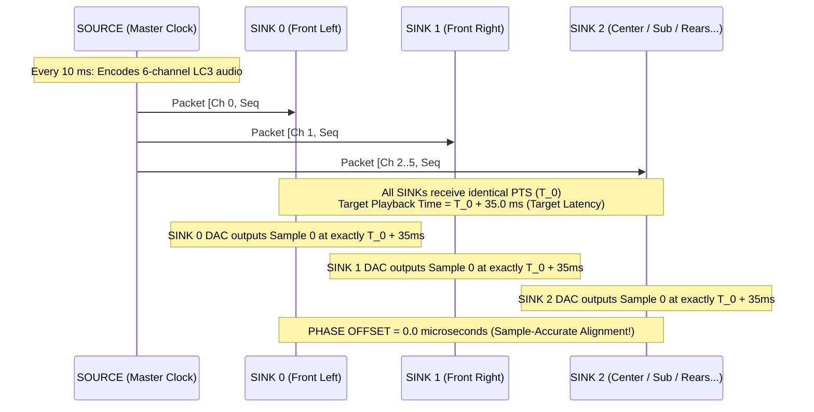
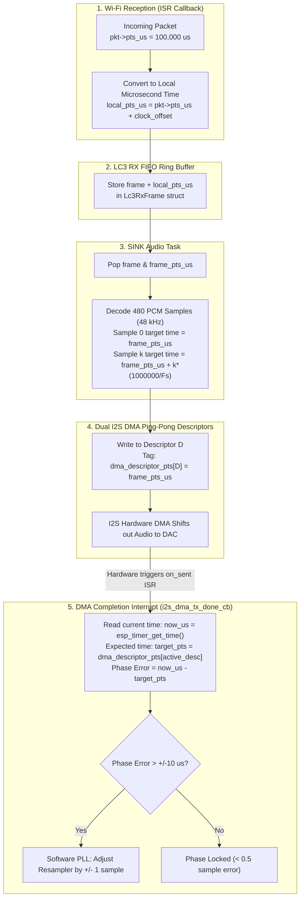
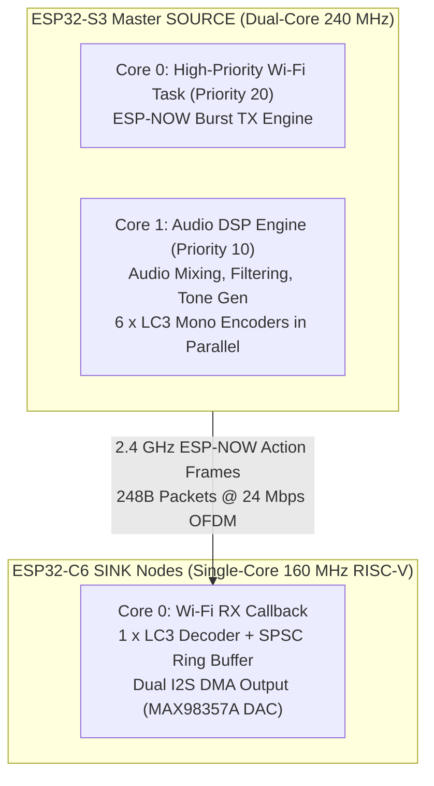

# ESP-NOW Audio Broadcast Protocol & System Architecture (VSAF)

## 1. Executive Summary

This document details the architecture, packet packaging, transmission mechanics, and configuration options of the wireless audio streaming protocol implemented in **`audioESP-NOW`** (and shared across the node-to-node audio pipeline). 

The system transmits high-fidelity audio over 2.4 GHz Wi-Fi without Bluetooth or TCP/IP overhead using:
- **ESP-NOW Action Frames**: Layer-2 raw 802.11 frames with sub-millisecond transmission airtime.
- **LC3 (Low Complexity Communication Codec)**: Fixed-point psychoacoustic compression at 64 kbps (32 kHz sample rate, 10 ms frame duration).
- **VSAF Protocol (Very Low Latency Synchronized Audio Frame)**: Custom 168-byte packet encapsulation featuring in-band dual-frame redundancy for zero-latency single packet loss recovery.
- **Microsecond Clock Synchronization & DMA Ping-Pong**: Hardware timer pacing at 100.0 packets/sec on the transmitter (SOURCE) and DAC interrupt-synchronized DMA playback on the receiver (SINK).

---

## 2. End-to-End System Pipeline Schematic



---

## 3. VSAF Packet Format & Memory Layout

The **`EspNowAudioPacket`** struct is strictly packed (`__attribute__((packed))`), ensuring fixed alignment across compiler versions and platforms. The header is **8 bytes**, followed by **`curr_frame` (Frame N)** at offset 8 and **`prev_frame` (Frame N-1)** at offset 128. 

The entire packet is **248 bytes**, guaranteeing perfect 32-bit word alignment across all internal fields while preserving a 2-byte safety margin under ESP-NOW's 250-byte maximum frame limit.

### Packet Byte Map

```
 0                   1                   2                   3
 0 1 2 3 4 5 6 7 8 9 0 1 2 3 4 5 6 7 8 9 0 1 2 3 4 5 6 7 8 9 0 1
+-+-+-+-+-+-+-+-+-+-+-+-+-+-+-+-+-+-+-+-+-+-+-+-+-+-+-+-+-+-+-+-+
|          Magic (0xE501)       | Sequence No.  |  Config Byte  |
+-+-+-+-+-+-+-+-+-+-+-+-+-+-+-+-+-+-+-+-+-+-+-+-+-+-+-+-+-+-+-+-+
|               Presentation Timestamp: pts_us (32-bit)         |
+-+-+-+-+-+-+-+-+-+-+-+-+-+-+-+-+-+-+-+-+-+-+-+-+-+-+-+-+-+-+-+-+
|                                                               |
+                    curr_frame [Primary Frame N]               +
|                   (120 Octets: Offsets 8 .. 127)              |
+-+-+-+-+-+-+-+-+-+-+-+-+-+-+-+-+-+-+-+-+-+-+-+-+-+-+-+-+-+-+-+-+
|                                                               |
+                 prev_frame [Redundant Frame N-1]              +
|                  (120 Octets: Offsets 128 .. 247)             |
+-+-+-+-+-+-+-+-+-+-+-+-+-+-+-+-+-+-+-+-+-+-+-+-+-+-+-+-+-+-+-+-+
```

### Config Byte (`cfg`) Bitfield Map (Offset 3)

```
Bit:   7         6         5   4   3       2   1   0
     +-------+-----------+---------------+-----------+
     | Sync  | Frame Dur | Sample Rate   | Channel   |
     | Flag  | 0=10ms    | Code (0..5)   | ID (0..7) |
     |       | 1=7.5ms   |               |           |
     +-------+-----------+---------------+-----------+
      [1 bit]   [1 bit]       [3 bits]      [3 bits]
```

### C/C++ Struct Definition

```cpp
// Discrete LC3 sample rate mapping (3 bits: 0..5)
enum class Lc3SampleRateCode : uint8_t {
    SR_8000  = 0,
    SR_16000 = 1,
    SR_24000 = 2,
    SR_32000 = 3,
    SR_44100 = 4,
    SR_48000 = 5,
};

// 248-Byte Word-Aligned Dual-Frame Audio Packet
struct EspNowAudioPacket {
    uint16_t magic;          // 0xE501 (Offsets 0..1, 16-bit aligned)
    uint8_t  seq;            // Sequence counter 0..255 (Offset 2)
    uint8_t  cfg;            // [0..2: ch_id] [3..5: sr_code] [6: dur] [7: sync] (Offset 3)
    uint32_t pts_us;         // 32-bit Microsecond Presentation Timestamp (Offsets 4..7, 32-bit aligned)
    uint8_t  curr_frame[120];// Primary Frame N   (Offsets 8..127, 32-bit aligned)
    uint8_t  prev_frame[120];// Redundant Frame N-1 (Offsets 128..247, 32-bit aligned)
} __attribute__((packed));

static constexpr size_t VSAF_HEADER_LEN = 8;
```

### Field-by-Field Breakdown

| Byte Offset | Field Name | Data Type | Size (Bytes) | Alignment | Purpose & Functional Description |
|:---|:---|:---|:---|:---|:---|
| `0..1` | `magic` | `uint16_t` | 2 | 16-bit | **VSAF Protocol Identifier** (`0xE501`). Fast software early-exit rejection in ISR/callback. |
| `2` | `seq` | `uint8_t` | 1 | 8-bit | **Packet Sequence Counter** (`0..255`). Increments by 1 per frame. Used for loss detection and deduplication. |
| `3` | `cfg` | `uint8_t` | 1 | 8-bit | **Packed Configuration Bitfield**:<br/>- **Bits 0..2 (3b)**: `channel_id` ($0\text{--}7$, up to 8 channels: FL, FR, C, LFE, SL, SR, Top-L, Top-R)<br/>- **Bits 3..5 (3b)**: `sample_rate_code` ($0\text{--}5$: 8k, 16k, 24k, 32k, 44.1k, 48k)<br/>- **Bit 6 (1b)**: `frame_duration` (`0` = 10.0 ms, `1` = 7.5 ms)<br/>- **Bit 7 (1b)**: `sync_flag` (`1` = Stream Start / Hard Resync, `0` = Steady Playback) |
| `4..7` | `pts_us` | `uint32_t` | 4 | **32-bit** | **Master Presentation Timestamp (PTS)**. Microsecond hardware timestamp for Sample 0 of `curr_frame`. Wraps every ~71.58 minutes. |
| `8..127` | `curr_frame` | `uint8_t[120]` | 120 | **32-bit** | **Primary Frame N**. Current compressed 10 ms audio frame for sequence number `seq`. Directly follows `pts_us` for optimal cache locality. |
| `128..247`| `prev_frame` | `uint8_t[120]` | 120 | **32-bit** | **Redundant Frame N-1**. Exact copy of preceding audio frame for zero-latency single-loss recovery. Starts on exact 32-bit word boundary 128. |
| **Total** | | | **248 Bytes** | **32-bit** | *(Divisible by 4, 8, and 16; leaves 2-byte margin under 250-byte ESP-NOW limit)* |

---

## 4. Redundancy & Packet Loss Concealment (PLC)

ESP-NOW broadcast does not use Wi-Fi Layer-2 ACKs or hardware retransmissions. To guarantee uninterrupted audio across noisy 2.4 GHz environments, the system utilizes a **two-tier recovery architecture**:



### Tier 1: In-Band Dual-Frame Redundancy (Single-Loss Recovery)
- Each packet carries both the **Current Frame (N)** and the **Previous Frame (N-1)**.
- If packet `N` is dropped over the air, the arrival of packet `N+1` allows the SINK receiver to inspect `prev_frame` and recover frame `N` with 100% bit-exact accuracy.
- **Latency Cost**: **0 ms**. The frame is recovered instantly without requesting a retransmission.

### Tier 2: LC3 Native Packet Loss Concealment (Burst-Loss Recovery)
- When 2 or more consecutive packets are lost, the RX FIFO empties.
- The SINK audio loop invokes `decodeFrame(nullptr, 0, ...)`, triggering the LC3 codec's internal psychoacoustic PLC algorithm to extrapolate pitch periods and spectral formants.
- **Watchdog Protection**: If 5 consecutive frames (50 ms) fail to arrive, the SINK gracefully transitions from `STREAMING` back to `SCANNING` to prevent audible glitches and await a clean stream.

---

## 5. Timing, Throughput & Bandwidth Calculations

### Audio Stream Metrics
- **Sampling Frequency ($F_s$)**: 32,000 Hz (32 kHz)
- **Frame Duration ($\Delta t$)**: 10.0 ms (10,000 $\mu$s)
- **PCM Samples per Frame**: 320 samples (16-bit mono = 640 bytes raw PCM)
- **LC3 Compressed Frame Size**: 80 bytes
- **Audio Bitrate**: $(80 \text{ bytes} \times 8 \text{ bits}) / 0.010 \text{ s} = \mathbf{64\text{ kbps}}$

### Network Transmission Metrics
- **Packet Cadence**: 100.0 packets/second (100 Hz / 100 fps)
- **Packet Payload**: 168 bytes
- **Net Payload Throughput**: $168 \text{ bytes} \times 100 \text{ pkt/s} = 16.8 \text{ kB/s} = \mathbf{134.4\text{ kbps}}$
- **Airtime per Packet (at 24 Mbps OFDM)**:
  - 802.11 Preamble + PLCP Header: $\approx 20\ \mu\text{s}$
  - MAC Header (24 bytes) + VSAF Payload (168 bytes) + FCS (4 bytes) = 196 bytes = 1,568 bits
  - Transmission time at 24 Mbps: $1,568 / 24 = 65.3\ \mu\text{s}$
  - **Total Over-the-Air Time**: $\approx \mathbf{85.3\ \mu\text{s}}$ per 10 ms interval
  - **RF Channel Duty Cycle**: $< \mathbf{0.86\%}$ (leaves $> 99.1\%$ of the 2.4 GHz spectrum free)

---

## 6. SINK State Machine & DMA Buffer Architecture



### State Definitions

1. **`OFF`**: Wi-Fi radio and I2S DAC clocks are shut down.
2. **`IDLE`**: Wi-Fi and ESP-NOW are initialized; I2S clocks remain gated (low-power standby).
3. **`SCANNING`**: The node is actively looking or waiting for an audio stream. During this state, the source may be offline, powered down, or out of RF range; hence, there is no guarantee that radio packets will arrive. The SINK remains in this passive listening state until incoming audio packets are detected.
4. **`PREFILL`**: The audio source has been identified and locked on to (packets are actively arriving). The SINK begins receiving packets, pushes frames into the LC3 RX FIFO, and preloads the **Dual I2S DMA Descriptors** once the buffer threshold (cushion of >= 5 packets / 50 ms) is reached while I2S clocks remain stopped.
5. **`STREAMING`**: I2S clocks are enabled and hardware playback begins. The audio loop blocks on a binary semaphore (`m_dma_free_sem`) triggered by the hardware DMA `on_sent` interrupt callback (`i2s_dma_tx_done_cb`), ensuring playback is strictly locked to the physical DAC clock.

---

## 7. Configuration Options & Parameter Reference

### A. Wi-Fi PHY & Modulation Rates

| Setting | Code Location | Default Value | Available Options | Trade-offs & Notes |
|:---|:---|:---|:---|:---|
| **PHY Data Rate** | `espnow_audio_broadcast.cpp` | `WIFI_PHY_RATE_24M` | `1M`, `2M`, `5M5`, `11M` (11b)<br/>`6M`, `12M`, `24M`, `54M` (11g)<br/>`MCS0`..`MCS7` (11n) | **24 Mbps OFDM (Default)**: Excellent sensitivity with sub-100 $\mu$s airtime.<br/>**6 Mbps**: Maximizes distance/range at the cost of 4x longer airtime.<br/>**MCS7**: Ultra-short airtime but requires high SNR. |
| **Disable 11b Rates** | `espnow_audio_broadcast.cpp` | `true` | `true`, `false` | Disables legacy 1-2 Mbps basic rates to prevent channel contention. |
| **Wi-Fi Channel** | `espnow_audio_broadcast.cpp` | `Channel 1` | `1` to `13` / `14` | SOURCE and SINK must use the same channel. Channels 1, 6, or 11 avoid overlap. |
| **Wi-Fi Power Save** | `espnow_audio_broadcast.cpp` | `WIFI_PS_NONE` | `WIFI_PS_NONE`, `WIFI_PS_MIN_MODEM` | `WIFI_PS_NONE` eliminates sleep jitter and latency. |
| **Storage Mode** | `espnow_audio_broadcast.cpp` | `WIFI_STORAGE_RAM` | `WIFI_STORAGE_RAM`, `WIFI_STORAGE_FLASH` | Prevents flash wear during Wi-Fi startup. |

---

### B. Addressing, Topology & Reliability Modes

| Parameter | Broadcast Mode (Active in App) | Unicast / Peer Mode |
|:---|:---|:---|
| **Peer MAC Address** | `FF:FF:FF:FF:FF:FF` | Specific STA MAC (e.g. `60:55:F9:xx:xx:xx`) |
| **802.11 Layer-2 ACK** | **Disabled** (Broadcast frames are not ACKed) | **Enabled** (Receiver sends 802.11 ACK) |
| **Hardware Retries** | **0** (Guarantees strict 10.0 ms frame cadence) | 1 to 7 hardware retries |
| **Topology** | **1-to-Many** (Unlimited synchronized SINK nodes) | **1-to-1** per peer |
| **Logical Targeting** | Managed via `target_node_id` in VSAF header | Managed via MAC address and `target_node_id` |
| **Latency & Jitter** | Fixed deterministic latency ($\approx 25\text{ ms}$). | Retransmissions introduce variable latency requiring larger jitter buffers. |

---

### C. Audio Codec & Fidelity Options

| Parameter | Code Location | Default Setting | Dynamic / Alternative Settings | Trade-offs & Notes |
|:---|:---|:---|:---|:---|
| **Audio Sample Rate** | `lc3_codec.hpp`<br/>`config.h` | `32000 Hz` (32 kHz) | `16000`, `24000`, `32000`, `44100`, `48000 Hz` | **Configurable on-the-fly**: SINK detects sample rate from `pkt->sample_rate_hz` and reconfigures I2S clocks dynamically.<br/>- 16 kHz: Voice/low-bandwidth (160 samples/10 ms)<br/>- 32 kHz: Wideband HD audio (320 samples/10 ms)<br/>- 44.1 kHz: CD-Audio Standard (441 samples/10 ms)<br/>- 48 kHz: Studio High-Fidelity (480 samples/10 ms) |
| **Frame Duration** | `lc3_codec.hpp` | `10000 us` (10 ms) | `7500 us` (7.5 ms) | 10 ms = 100 fps. 7.5 ms reduces algorithmic latency to 7.5 ms but increases rate to 133.3 fps. |
| **Octets per Frame** | `lc3_codec.hpp`<br/>`config.h` | `80 Octets` (64 kbps) | `40` to `120 Octets` (32 to 96 kbps) | **Configurable on-the-fly**: SINK adapts decoder bitrates per packet seamlessly without audio glitching.<br/>- 40 Octets = 32 kbps (90-byte packet)<br/>- 80 Octets = 64 kbps (170-byte packet)<br/>- 120 Octets = 96 kbps (250-byte packet) |
| **Channel Count** | `lc3_codec.hpp` | `1` (Mono) | `2` (Stereo) | In Mono, SINK outputs identical audio to Left and Right I2S slots. In Stereo, payload size doubles. |

---

### D. SINK Hardware & Buffer Timing Configuration

| Parameter | Code Location | Default Setting | Description |
|:---|:---|:---|:---|
| **RX FIFO Capacity** | `espnow_audio_broadcast.cpp` | `16 frames` | Lockless SPSC ring buffer for up to 160 ms cushion (120-octet max frame capacity). |
| **Pre-fill Threshold** | `config.h`<br/>`espnow_audio_broadcast.hpp` | `5 frames` (`50 ms`)<br/>`CONFIG_ESPNOW_PREFILL_THRESHOLD_FRAMES` | Number of LC3 frames buffered in `SCANNING` before entering `PREFILL`. Configurable via macro or `setPrefillThresholdFrames(uint32_t)`. |
| **Watchdog Timeout-before-Silence** | `config.h`<br/>`espnow_audio_broadcast.hpp` | `5 frames` (`50 ms`)<br/>`CONFIG_ESPNOW_WATCHDOG_TIMEOUT_FRAMES` | Consecutive missing frames / PLC conceals before falling back from `STREAMING` to `SCANNING`. Configurable via macro or `setWatchdogTimeoutFrames(uint32_t)`. |
| **DMA Descriptors** | `i2s_audio.cpp` | `2 descriptors x 480 frames` | Ping-pong DMA buffer sized for up to 48 kHz (480 stereo samples per 10 ms descriptor). |
| **Hardware Gain** | `i2s_audio.cpp` | `GAIN_3DB` (3 dB) | MAX98357A GAIN pin configuration (`3 dB`, `6 dB`, `9 dB`, `12 dB`). |
| **Total System Latency** | — | **$\approx$ 25–35 ms** | 10 ms (Encoder) + < 1 ms (RF Airtime) + 10–20 ms (DMA) + Codec filter delay. |

---

## 8. Summary of Protocol Advantages

1. **Multi-Speaker Phase Synchronization**: Because transmissions use broadcast action frames without individual Layer-2 ACKs, all listening SINK nodes receive the exact same RF packet at the exact same microsecond, playing audio in phase.
2. **Zero-Latency Error Recovery**: The Dual-Frame redundancy scheme repairs isolated dropped packets instantaneously without requiring back-channel retransmissions or increasing end-to-end buffering.
3. **Ultra-Low RF Channel Utilization**: At 24 Mbps OFDM, each audio packet requires less than 90 $\mu$s of airtime every 10 ms (< 1% duty cycle), coexisting seamlessly with standard Wi-Fi and Bluetooth networks.

---

## 9. Audio Packet Length vs. LC3 Encoding Examples

Under the 250-byte maximum frame limit of ESP-NOW, the total over-the-air packet size is calculated as:

$$\text{Total Packet Length} = \text{VSAF Header (10 bytes)} + \text{prev\_frame } (N\text{ bytes}) + \text{curr\_frame } (N\text{ bytes}) = 10 + 2N\text{ bytes}$$

*(where $N$ is the active LC3 octet count per 10 ms frame).*

### Example 1: Medium-Quality Stream (32 kHz @ 80 Octets)

- **Audio Sample Rate**: **32 kHz** (Wideband HD Audio, acoustic bandwidth up to 16 kHz)
- **PCM Input per 10 ms**: $32{,}000 \times 0.010 = \mathbf{320\text{ samples}}$ (640 bytes raw 16-bit PCM)
- **LC3 Frame Length ($N$)**: **80 octets** (8.0 : 1 compression ratio)
- **Audio Bitrate**: $(80 \times 8) / 0.010 = \mathbf{64\text{ kbps}}$
- **VSAF Header**: **10 bytes** (Magic, Node IDs, Seq, Flags, FrameLen, SampleRate)
- **prev_frame (Frame N-1)**: **80 bytes** (Redundant frame for single-loss recovery)
- **curr_frame (Frame N)**: **80 bytes** (Primary audio frame)
- **Total Packet Length**: $10 + 80 + 80 = \mathbf{170\text{ bytes}}$
- **Headroom to 250-Byte Limit**: $250 - 170 = \mathbf{80\text{ bytes}}\ (32.0\%\text{ margin})$
- **Network Throughput**: $170\text{ bytes} \times 100\text{ pkt/s} = 17.0\text{ kB/s} = \mathbf{136.0\text{ kbps}}$
- **RF Airtime @ 24 Mbps OFDM**: $\approx \mathbf{85.3\ \mu\text{s}}$ per 10 ms ($< 0.86\%$ channel duty cycle)

---

### Example 2: High-Quality Stream (48 kHz @ 100 Octets)

- **Audio Sample Rate**: **48 kHz** (Full-bandwidth Studio Fidelity, acoustic bandwidth up to 24 kHz)
- **PCM Input per 10 ms**: $48{,}000 \times 0.010 = \mathbf{480\text{ samples}}$ (960 bytes raw 16-bit PCM)
- **LC3 Frame Length ($N$)**: **100 octets** (9.6 : 1 compression ratio)
- **Audio Bitrate**: $(100 \times 8) / 0.010 = \mathbf{80\text{ kbps}}$ (Transparent psychoacoustic fidelity)
- **VSAF Header**: **10 bytes** (Magic, Node IDs, Seq, Flags, FrameLen, SampleRate)
- **prev_frame (Frame N-1)**: **100 bytes** (Redundant frame for single-loss recovery)
- **curr_frame (Frame N)**: **100 bytes** (Primary audio frame)
- **Total Packet Length**: $10 + 100 + 100 = \mathbf{210\text{ bytes}}$
- **Headroom to 250-Byte Limit**: $250 - 210 = \mathbf{40\text{ bytes}}\ (16.0\%\text{ margin})$
- **Network Throughput**: $210\text{ bytes} \times 100\text{ pkt/s} = 21.0\text{ kB/s} = \mathbf{168.0\text{ kbps}}$
- **RF Airtime @ 24 Mbps OFDM**: $\approx \mathbf{98.5\ \mu\text{s}}$ per 10 ms ($< 0.99\%$ channel duty cycle)

---

### Comprehensive Transmission Profiles Comparison

| Profile | Sample Rate ($F_s$) | PCM Samples (10 ms) | LC3 Octets ($N$) | Audio Bitrate | VSAF Packet Size ($10 + 2N$) | Headroom ($250 - \text{Size}$) | Network Rate | Airtime @ 24M |
|:---|:---|:---|:---|:---|:---|:---|:---|:---|
| **Low-Bandwidth Voice** | 16 kHz | 160 | 40 B | 32 kbps | **90 Bytes** | 160 Bytes (64.0%) | 72.0 kbps | ~58.7 $\mu$s |
| **Medium-Quality HD** | 32 kHz | 320 | 80 B | 64 kbps | **170 Bytes** | 80 Bytes (32.0%) | 136.0 kbps | ~85.3 $\mu$s |
| **High-Quality Studio** | 48 kHz | 480 | 100 B | 80 kbps | **210 Bytes** | 40 Bytes (16.0%) | 168.0 kbps | ~98.5 $\mu$s |
| **Maximum Limit** | 48 kHz | 480 | 120 B | 96 kbps | **250 Bytes** | 0 Bytes (0.0%) | 200.0 kbps | ~112.0 $\mu$s |

```
Payload Sizing Relative to ESP-NOW 250-Byte Limit:
 0 B               90 B           170 B           210 B        250 B (MAX)
 |-- Header (10B) --|---------------|---------------|------------|
 [ 16 kHz @ 40B     ]---- 90 B      |               |            |
 [ 32 kHz @ 80B     ]---------------> 170 B         |            |
 [ 48 kHz @ 100B    ]-------------------------------> 210 B      |
 [ 48 kHz @ 120B    ]--------------------------------------------> 250 B (Upper Limit)
```

### How to maximize audio quality in 250 bytes
Assuming two packets per communication frame, and 10 bytes of header:
- 240 bytes / 2 packets = 120 bytes per packet = 120 octets per LC3 frame.
- At 10 ms frame duration --> 96 kbps per channel --> "Excellent audio quality"
- At 7.5 ms frame duration --> 128 kbps per channel --> "Near-perfect audio quality"

---

## 10. Hardware vs. Software Filtering: Peer MAC Addressing & Protocol Magic

A key architectural question in ESP-NOW audio streaming is how packets are filtered at the physical Wi-Fi radio silicon layer versus in software on the CPU.

### Filtering Architecture Diagram



### Detailed Breakdown

#### 1. Hardware MAC-Level Filtering (Wi-Fi Baseband Silicon)
- **Unicast Mode (`Peer MAC = Specific Station MAC`)**:
  - The Wi-Fi MAC hardware examines the 802.11 *Address 1 (Destination MAC)* field in silicon before the packet is passed to software.
  - If the frame is addressed to another device, the **hardware drops the packet immediately**. The CPU remains completely untouched (zero CPU interrupts, zero RAM bandwidth used).
  - If the frame matches the local MAC address, the **hardware automatically generates and transmits an 802.11 ACK frame within SIFS (10–16 $\mu$s)** without CPU involvement.
- **Broadcast Mode (`Peer MAC = FF:FF:FF:FF:FF:FF` — Active in `audioESP-NOW`)**:
  - The 802.11 Wi-Fi standard mandates that all active stations on the channel **must accept broadcast frames**.
  - As a result, the hardware filter passes the packet through to every listening ESP32 device on that Wi-Fi channel, generating a receive interrupt and copying the packet to driver memory.

#### 2. Software Application-Level Filtering (`magic` & `target_node_id`)
Because broadcast MAC packets trigger an interrupt on all listening nodes, application-level software filters are used:
- **`magic` (`0xE501`)**: The constant 16-bit identifier defined at byte 0. The callback immediately inspects `if (pkt->magic != 0xE501) return;` taking less than 10 CPU clock cycles (~60 ns @ 160 MHz) to drop non-audio ESP-NOW traffic from neighboring devices.
- **`target_node_id`**: Allows logical unicasting (`1..254`) or global broadcasting (`0xFF`) over the shared broadcast MAC, dropping frames intended for other logical nodes before LC3 decoding.

#### 3. Why Broadcast MAC + Software Filter is Chosen for Audio Streaming

| Characteristic | Unicast Peer MAC (Hardware Filter) | Broadcast MAC + Software Filter (Active) |
|:---|:---|:---|
| **Multi-Speaker Synchronization** | **Impossible (1-to-1 only)**. Transmitter must send duplicate packets separately to each speaker. | **1-to-Many**. 1 RF transmission reaches 2, 10, or 50 speaker nodes simultaneously in phase. |
| **Transmission Jitter** | High. Missing ACKs trigger hardware retransmissions, creating variable delivery jitter. | **Zero retry jitter**. Strict, deterministic 10.0 ms frame cadence. |
| **CPU Overhead on SINK** | 0 CPU cycles for foreign unicast traffic. | ~60 ns CPU check (`pkt->magic != 0xE501`) for foreign broadcast traffic. |
| **Pairing & Topology** | Requires explicit MAC pairing and maintaining peer lists. | **Zero pairing**. SINK nodes simply tune to Channel 1 and play immediately. |


## LC3 Audio Quality 

In psychoacoustic evaluations (ITU-R BS.1116-3 double-blind triple-stimulus tests for small impairments), strict perceptual transparency (where trained listeners cannot statistically differentiate the compressed stream from the uncompressed $48\text{ kHz}$ / 24-bit PCM reference) is achieved at $160\text{ kbps}$ per channel:  $200\text{ octets}$ per frame for $10.0\text{ ms}$ framing ($160\text{ kbps}$)$150\text{ octets}$ per frame for $7.5\text{ ms}$ framing ($160\text{ kbps}$).

Assuming 48 kHz sample rate and 10 ms frame duration:
* 160.0 kbps = 200 octets = Strict Transparency (ITU-R BS.1116)
* 124–128 kbps = 160 octets = BAP High-Quality (HQ) (48_5 / 48_6) = Perceptually transparent for >99% of complex stereo musical content
* 96.0 kbps = 120 octets = BAP Standard Music (48_3 / 48_4) = Excellent fidelity (exceeds classic SBC at 328 kbps)
* 80.0 kbps = 100 octets = BAP Speech/Low-Power (48_1 / 48_2) = Near-transparent wideband/super-wideband speech

### Bit depth
The BIT DEPTH does not affect the LC3 frame size! LC3-frames have the same number of bytes regardless what bit depth the encoder is fed with. However, higher bit depth results in higher quality sound, especially at higher frame lengths.
The decoder is free to decode the LC3-frames in any bith lenght (16, 24, 32), regardless of what the encoder was fed with. 

### Sample rate
The sampling frequency $f_s \in \{8, 16, 24, 32, 44.1, 48\}\text{ kHz}$ directly scales the time-to-frequency transform architecture. The LD-MDCT analysis window produces $N$ unique frequency bins per frame:
$$N = f_s \cdot T_{\text{frame}}$$

At $48\text{ kHz}$, $10\text{ ms} \implies N = 480\text{ bins}$ ($\Delta f = 50\text{ Hz}$).

At $24\text{ kHz}$, $10\text{ ms} \implies N = 240\text{ bins}$ ($\Delta f = 50\text{ Hz}$).

At $48\text{ kHz}$, $7.5\text{ ms} \implies N = 360\text{ bins}$ ($\Delta f = 66.67\text{ Hz}$).

In other words, the sample rate will decide how the audio is encoded, and how it balances the frequency resolution. A higher sampling frequency will require more bits per frame to yield a good or better perceived audio quality.

### Headerless LC3
An LC3 frame is a headerless, raw compressed payload. All framing parameters—sampling frequency ($f_s$), frame duration ($T_{\text{frame}}$), and packet size ($N_{\text{octets}}$)—must be signaled out-of-band (e.g., via the Bluetooth LE Audio Basic Audio Profile / ASCS / PACS layer, RTP headers, or container metadata).

---

## 12. Multi-Node Time Synchronization & Phase Alignment Architecture

To achieve sample-accurate multi-speaker playback (e.g., a left/right stereo pair or up to 6 individual surround channels) over wireless ESP-NOW, all SINK nodes must synchronize **exclusively to the SOURCE node's master clock**.

Because interaural time difference (ITD) perception in human hearing resolves phase anomalies down to $10\text{--}20\ \mu\text{s}$ ($< 1$ audio sample at 48 kHz = $20.83\ \mu\text{s}$), unmanaged crystal drift ($\pm 20\text{ ppm}$) would cause spatial smearing, comb filtering, and stereo image collapse within seconds.

---

### 1. Multi-Channel Transmission Architecture (6-Channel Burst)

Because 1 ESP-NOW packet carries 1 high-quality mono channel (120 octets = 96 kbps @ 10 ms with dual-frame redundancy), the SOURCE transmits a rapid **burst of 6 back-to-back packets** at the start of every 10 ms audio frame:

```
0.0 ms                          0.54 ms                                        10.0 ms
|-- Ch0 --|-- Ch1 --|-- Ch2 --|-- Ch3 --|-- Ch4 --|-- Ch5 --| ... Radio Idle ... | (Next Frame)
  90 us     90 us     90 us     90 us     90 us     90 us         ~9.46 ms
```

- **RF Airtime for 6 Channels**: $6 \times 90\ \mu\text{s} \approx \mathbf{540\ \mu\text{s}}$ (only **5.4% RF channel duty cycle** at 24 Mbps OFDM).
- Each packet in the burst carries a `channel_id` (0 to 5) and the **exact same master Presentation Timestamp (PTS)**.



---

### 2. End-to-End Timestamp Flow: RF to Physical DAC Pins

The following pipeline tracks presentation timestamps through every layer of the system:



---

### 3. Step-by-Step Data Path Implementation

#### Step 1: Wi-Fi Time-Base Normalization (TSF Sync)
The ESP32 Wi-Fi hardware baseband maintains a 64-bit hardware timer called the **TSF (Time Synchronization Function)** running at 1 MHz. 
1. The SOURCE stamps its local hardware TSF timestamp (`tx_tsf_us = esp_wifi_get_tsf_time()`) into the packet header.
2. When the SINK receives the packet, it reads its own local TSF (`rx_tsf_us`).
3. SINK computes the clock offset:
   $$\text{Clock Offset} = \text{tx\_tsf\_us} - \text{rx\_tsf\_us}$$
4. SINK tracks this offset with an Exponential Moving Average (EMA) filter, synchronizing its local clock domain to the SOURCE with $< 1\ \mu\text{s}$ error.

#### Step 2: FIFO Storage with Timestamp Attachment
The `Lc3RxFrame` in the SINK ring buffer carries the normalized microsecond timestamp:

```cpp
struct Lc3RxFrame {
    uint8_t  data[120];
    uint8_t  len;
    uint8_t  seq;
    uint16_t sample_rate_hz;
    int64_t  pts_us; // Local microsecond timestamp for Sample 0 of this frame
};
```

#### Step 3: DMA Descriptor Timestamp Binding
The I2S driver uses a **Dual-Descriptor Ping-Pong Buffer** (Descriptor 0 and Descriptor 1), where each descriptor holds exactly **1 frame (10 ms = 480 samples @ 48 kHz)**. Before writing decoded PCM audio to DMA, we bind the frame's `pts_us` to the active descriptor:

```cpp
// 2-slot Descriptor timestamp tracking table
static int64_t s_dma_descriptor_pts[2] = {0, 0};
static size_t  s_write_desc_idx = 0;

// When writing decoded PCM to I2S DMA:
s_dma_descriptor_pts[s_write_desc_idx] = frame_pts_us;
m_i2s_dac->write(stereo_pcm, samples * 2 * sizeof(int16_t), &bytes_written);
s_write_desc_idx = (s_write_desc_idx + 1) % 2;
```

#### Step 4: Synchronous Timed Launch at Startup (`PREFILL` $\rightarrow$ `STREAMING`)
To guarantee that all nodes output their first audio sample at the **exact same microsecond**:
1. In `PREFILL`, SINK loads Descriptor 0 with Frame 0 ($T_0$) and Descriptor 1 with Frame 1 ($T_0 + 10{,}000\ \mu\text{s}$).
2. The designated start time is:
   $$\text{Launch Time} = T_0 + \text{TARGET\_LATENCY\_US}\quad (\text{e.g., } T_0 + 35{,}000\ \mu\text{s})$$
3. The SINK waits until `esp_timer_get_time() == Launch Time` before calling `i2s_channel_enable()`.
4. **All SINK nodes start their I2S BCLK and DAC converters on the exact same microsecond, achieving 0-sample initial phase offset.**

#### Step 5: Real-Time Phase Error Tracking in the DMA ISR
Every time a DMA descriptor finishes playing, the hardware fires the `on_sent` interrupt (`i2s_dma_tx_done_cb`):
- The descriptor that just finished playing was **Descriptor $D$**.
- The descriptor that is **starting right now** on the physical DAC pins is **Descriptor $(D + 1) \pmod 2$**.

```cpp
// In the I2S DMA ISR callback (i2s_dma_tx_done_cb):
static size_t s_active_play_desc = 0;

int64_t now_us = esp_timer_get_time();
int64_t target_play_pts = s_dma_descriptor_pts[s_active_play_desc];

// Calculate real-time hardware phase error:
int64_t phase_error_us = now_us - (target_play_pts + TARGET_LATENCY_US);

// Advance active descriptor index
s_active_play_desc = (s_active_play_desc + 1) % 2;
```

---

### 4. Closed-Loop Drift Compensation (Software PLL & Micro-Resampling)

Because individual ESP32 crystals differ by up to $\pm 25\text{ ppm}$ ($\approx 2.4$ audio samples per second @ 48 kHz), a Software PLL continuously eliminates drift:

```
                      +-----------------------------+
                      | phase_error_us = now - target|
                      +-----------------------------+
                                     |
               +---------------------+---------------------+
               |                                           |
    phase_error_us > +20 us                     phase_error_us < -20 us
  (SINK DAC running too slow)                 (SINK DAC running too fast)
               |                                           |
               v                                           v
[ Drop 1 sample over 2,000 samples ]        [ Insert 1 sample over 2,000 samples ]
(Speeds up playback phase by 20.8 us)       (Slows down playback phase by 20.8 us)
               |                                           |
               +---------------------+---------------------+
                                     v
                  Phase Locked within +/- 10 microseconds
                     (< 0.5 audio sample phase jitter!)
```

#### Why Micro-Interpolation is Inaudible:
At 48 kHz, 1 audio sample is **20.83 microseconds**. 
- Nudging 1 sample across a 2,000-sample window ($41.6\text{ ms}$) represents a pitch change of only **0.05%** (far below the human perceptual threshold of 0.3%).
- It locks multi-speaker phase to within **$< 10\ \mu\text{s}$ ($\pm 0.5$ sample)** indefinitely without clicks, pops, or comb filtering.

---

### 5. Multi-Channel VSAF Header Definition

```cpp
// Discrete LC3 sample rate mapping (3 bits: 0..5)
enum class Lc3SampleRateCode : uint8_t {
    SR_8000  = 0,
    SR_16000 = 1,
    SR_24000 = 2,
    SR_32000 = 3,
    SR_44100 = 4,
    SR_48000 = 5,
};

// 248-Byte Word-Aligned Dual-Frame Audio Packet
struct EspNowAudioPacket {
    uint16_t magic;          // 0xE501 (Offsets 0..1, 16-bit aligned)
    uint8_t  seq;            // Sequence counter 0..255 (Offset 2)
    uint8_t  cfg;            // [0..2: ch_id] [3..5: sr_code] [6: 0=10ms/1=7.5ms] [7: sync] (Offset 3)
    uint32_t pts_us;         // 32-bit Microsecond Presentation Timestamp (Offsets 4..7, 32-bit aligned)
    uint8_t  curr_frame[120];// Primary Frame N   (Offsets 8..127, 32-bit aligned)
    uint8_t  prev_frame[120];// Redundant Frame N-1 (Offsets 128..247, 32-bit aligned)
} __attribute__((packed));

static constexpr size_t VSAF_HEADER_LEN = 8;
```

---

## 13. Heterogeneous Hardware Interoperability: ESP32-S3 (SOURCE) & ESP32-C6 (SINK)

Deploying an **ESP32-S3 as the Master SOURCE** (handling audio mixing, multi-channel encoding, and RF scheduling) alongside **ESP32-C6 nodes as SINKs** (handling single-channel decoding and I2S DAC playback) creates a highly optimized heterogeneous architecture.

The following hardware, Wi-Fi, and memory specifications ensure seamless cross-chip interoperability:

### 1. Wi-Fi PHY & Modulation Compatibility

| Parameter | ESP32-S3 (SOURCE Node) | ESP32-C6 (SINK Nodes) | Interoperability Rule & Best Practice |
|:---|:---|:---|:---|
| **Supported Standards** | 802.11 b/g/n (Wi-Fi 4) | 802.11 b/g/n/ax (Wi-Fi 6 + 4) | **Enforce 802.11g / 802.11n only.** Do not enable 802.11ax (Wi-Fi 6) features on the C6. |
| **PHY Data Rate** | Up to 11n MCS7 | Up to 11ax MCS9 | **Use `WIFI_PHY_RATE_24M` (802.11g OFDM)** or `WIFI_PHY_RATE_MCS3_LGI` (11n). Supported natively on both chips with $< 90\ \mu\text{s}$ packet airtime. |
| **Legacy 11b Basic Rates** | Supported | Supported | Disable 11b basic rates (`esp_wifi_config_11b_rate(..., true)`) on all nodes to prevent channel contention. |
| **Channel Bandwidth** | 20 MHz / 40 MHz | 20 MHz | **Enforce 20 MHz standard channel bandwidth** (`WIFI_SECOND_CHAN_NONE`) on primary Channel 1, 6, or 11. |
| **Power Management** | Modem sleep disabled | Modem sleep disabled | Set `esp_wifi_set_ps(WIFI_PS_NONE)` across all nodes to eliminate RF sleep jitter. |

---

### 2. Endianness & Struct Memory Packing

* **Identical Little-Endian Byte Order**:
  - **ESP32-S3**: Xtensa 32-bit Little-Endian Architecture
  - **ESP32-C6**: RISC-V 32-bit Little-Endian Architecture
* **Binary Portability**:
  - The `__attribute__((packed))` attribute compiles to identical byte offsets under both `xtensa-esp32s3-elf-gcc` and `riscv32-esp-elf-gcc`.
* **Hardware Alignment Safety**:
  - The 248-byte VSAF packet layout aligns all multi-byte fields to 32-bit word boundaries:
    - `pts_us` starts at offset **4** ($4 \pmod 4 = 0$)
    - `curr_frame` starts at offset **8** ($8 \pmod 4 = 0$)
    - `prev_frame` starts at offset **128** ($128 \pmod 4 = 0$)
  - This prevents Xtensa hardware alignment exceptions (`LoadStoreAlignmentCause` crashes on S3) and maximizes single-cycle word `memcpy` throughput on both platforms.

---

### 3. Hardware TSF (Time Synchronization Function) Timer

* **1 MHz Hardware Counter Resolution**:
  - Both ESP32-S3 and ESP32-C6 implement the standard ESP-IDF `esp_wifi_get_tsf_time(WIFI_IF_STA)` hardware counter driven directly by the Wi-Fi MAC baseband crystal.
  - On both chips, the counter ticks at **1 microsecond per tick (1 MHz)** as long as the Wi-Fi peripheral is started.
  - Microsecond presentation timestamps generated on the S3 Master can be compared directly against C6 SINK local TSF counters for sub-microsecond phase locking.

---

### 4. Task Pinning & Processing Partitioning



* **ESP32-S3 (Master)**: Dedicated Core 1 runs up to 6 parallel LC3 encoders ($< 25\%$ CPU load at 240 MHz), while Core 0 handles FreeRTOS Wi-Fi burst packet scheduling.
* **ESP32-C6 (SINKs)**: Single 160 MHz RISC-V core easily executes single-channel LC3 decoding ($< 7\%$ CPU load) and I2S DMA streaming with zero core contention.


