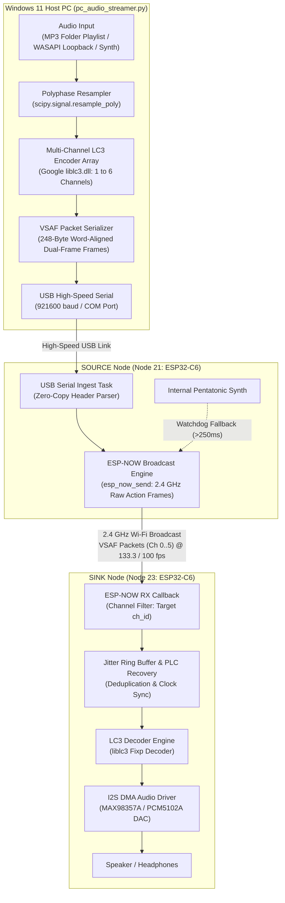

# audioESP-NOW: High-Fidelity Wireless Audio Streaming via ESP-NOW & LC3

`audioESP-NOW` is a low-latency wireless audio streaming system for Espressif ESP32-C6 and ESP32-S3 microcontrollers. It broadcasts compressed, synchronized multi-channel audio over 2.4 GHz Wi-Fi Action Frames using the **Very Low Latency Synchronized Audio Frame (VSAF)** protocol and the **Low Complexity Communication Codec (LC3)**.

The Bluetooth stack is completely disabled in firmware, freeing 100% of the radio and memory resources for real-time Wi-Fi DMA audio streaming.

---

## Key Features

- **Ultra-Low Latency**: End-to-end latency of 15–20 ms from PC audio generation to physical speaker output.
- **LC3 Compression**: Fixed-point psychoacoustic LC3 encoding (Google `liblc3`) providing studio-grade audio quality at low bitrates (64–96 kbps per channel).
- **Flexible Sample Rates**: Dynamic run-time support for **8 kHz, 16 kHz, 24 kHz, 32 kHz, 44.1 kHz, and 48 kHz**.
- **Dual Frame Durations**: Selectable **7.5 ms** (133.3 fps) and **10.0 ms** (100.0 fps) framing with live on-the-fly re-negotiation.
- **In-Band Dual-Frame Redundancy**: Every VSAF packet contains both the current frame ($N$) and previous frame ($N-1$), recovering single isolated packet drops with zero latency without retransmission requests.
- **Microsecond Clock Synchronization**: Presentation Time Stamps (PTS) embedded in packet headers prevent clock drift, DMA buffer underruns, and buffer overflows.
- **Multi-Channel Speaker Addressing**: Broadcasts 1 to 6 discrete channels (Left, Right, Center, LFE, Surround-Left, Surround-Right). SINK nodes filter and play their assigned channel ID (`ch 0..5`) dynamically.
- **Zero-Overhead USB Pass-Through & Autonomous Fallback**:
  - Ingests pre-encoded VSAF packets from a Windows 11 PC over high-speed USB Serial (921600 baud) for `< 4%` CPU utilization on the transmitter.
  - Automatically falls back to an internal on-chip pentatonic tone generator if USB PC streaming pauses for $>250\text{ ms}$, ensuring the wireless network remains active.

---

## System Architecture



For full protocol packet layout, bitfields, and recovery mechanisms, see the [VSAF Protocol Specification](ESP-NOW_protocol.md).

---

## Target Hardware & Pinout

### Tested Hardware Nodes & COM-Port Layout

| Node ID | Role | Board Type | Port | Baud Rate | Primary Function |
| :--- | :--- | :--- | :--- | :--- | :--- |
| **Node 16** | **SOURCE** | [ESP32-S3-XIAO](https://www.seeedstudio.com/XIAO-ESP32S3-p-5627.html) | **COM16** | **115,200 baud** (2 Mbaud stream) | **High-Fidelity LC3 Broadcaster** & Bumble HCI |
| **Node 21** | **SINK** | [ESP32-C6-WROOM-1](https://www.amazon.se/dp/B0CN66P5XY) (32-pin DevKit) | **COM21** | **115,200 baud** (460,800 flash) | **Audio Playback** (I2S DAC / Speaker) & Diagnostics |
| **Node 23** | **SINK** | [Waveshare ESP32-C6-Zero](https://www.amazon.se/dp/B0F12PRH9G) (18-pin Mini) | **COM23** | **115,200 baud** (460,800 flash) | **Audio Playback** (I2S DAC / Speaker) & Diagnostics |
| **Node 24** | **SINK** | [Waveshare ESP32-C6-Zero](https://www.amazon.se/dp/B0F12PRH9G) (18-pin Mini) | **COM24** | **115,200 baud** (460,800 flash) | **Audio Playback** (I2S DAC / Speaker) & Diagnostics |

#### Baud Rate Selection Rationale

* **2,000,000 baud (Audio Streaming & Bumble on COM121)**: Dual-frame redundant VSAF streaming at 48 kHz / 7.5 ms sends 266.6 packets/sec (248 bytes/packet), requiring a 661.2 kbps wire rate for Stereo. At 2.0 Mbaud (exact 40.0 integer divisor from ESP32-C6 80 MHz APB clock, 0.00% error), Stereo consumes only **33.1% bus load**, 3 channels (2.1) consumes **49.6%**, and 4 channels (Quad) consumes **66.1%**, providing massive headroom for multi-channel expansion without packet dropouts.
* **460,800 baud (Firmware Flashing on COM21 / COM121)**: Flashes a 1.0 MB application binary in ~14–16 seconds via `esptool.py` with 100% hash verification reliability.
* **115,200 baud (Telemetry & Interactive Console on COM21)**: Standard speed matching the ESP32-C6 ROM bootloader. Used for live 1 Hz diagnostics (`idf.py monitor` / Tera Term) and runtime ASCII commands (`rate`, `dur`, `ch`).

### I2S DAC Wiring (SINK Node)

The SINK firmware outputs standard digital audio over I2S to external DAC modules (e.g. **MAX98357A** Class-D Mono Amp or **PCM5102A** Stereo DAC):

| Signal | ESP32-C6-WROOM-1 (Node 21) | ESP32-C6-Zero (Node 23 & 24) | MAX98357A / PCM5102A Pin |
| :--- | :--- | :--- | :--- |
| **V+** | - | 5V (pin1) | `Vin` |
| **GND** | - | GND (pin2) | `GND` |
| **SD** | - | 3.3V (pin3) | `SD` (Shut Down) |
| **GAIN** | - | GPIO 0 (pin4) | `GAIN` |
| **DIN** | - | GPIO 1 (pin5) | `DIN` |
| **BCLK** | - | GPIO 2 (pin6) | `BCLK` |
| **LRC** | - | GPIO 3 (pin7) | `LRC` |
| **WS2812 RGB LED** | GPIO 8 | GPIO 8 | Onboard status indicator |


---


## Audio Architecture & VSAF Protocol

### Packet Structure (VSAF Dual-Frame Redundancy)
ESP-NOW audio packets use the VSAF container format:
- **8-Byte Header**:
  - `magic` (2B): `0x1337`
  - `seq` (2B): Monotonically incrementing 16-bit sequence number
  - `cfg` (1B): Bitfield (Bit 0: Redundancy present, Bit 1: Stereo mode, Bits 2-3: Channel index, Bits 4-7: Reserved)
  - `pts_us` (3B): Presentation timestamp in microseconds modulo 2^24
- **Payload**:
  - Primary Frame (Frame N, e.g., 120 bytes)
  - Redundant Frame (Frame N-1, e.g., 120 bytes)

### Supported Audio Configurations
- **Sample Rates**: 48.0 kHz, 32.0 kHz, 24.0 kHz, 16.0 kHz, 8.0 kHz
- **Frame Cadence**: 10.0 ms (Default) and 7.5 ms
- **Bitrates / Frame Sizes**:
  - 10.0 ms @ 120 octets = 96 kbps per channel
  - 7.5 ms @ 120 octets = 128 kbps per channel
- **Channel Modes**:
  - **Mono Mode**: Single LC3 encode; packet duplicated into two VSAF packets for Ch 0 and Ch 1.
  - **Stereo Mode**: Two distinct LC3 encodes; sent as independent VSAF packets for Ch 0 and Ch 1.

### Critical Timing Requirement
Audio broadcasting MUST use absolute microsecond hardware timer pacing (`esp_timer_get_time()`) instead of relative delays (`vTaskDelayUntil` / `vTaskDelay`) to eliminate clock drift and frame creep.

---

## Prerequisites & Dependencies

### Hardware Requirements
1. At least two ESP32's: One as SOURCE and one as SINK.
  * SINK nodes runs LC3 decoding, which is less compute-heavy than encoding. ESP32-C6 are used as SINKs in this project. About 2.0 ms is required for an ESP32-C6 to decode one 48 kHz, 120 B LC3-frame using ESP-IDF's fixed-point `esp_lc3`.
  * SOURCE nodes need to do real-time LC3 encoding, which is compute-heavy for embedded system. The low-performance ESP32's, e.g. (C6 and ESP32-WROOM-32) are NOT powerful enough to run real-time LC3 encoding for more than one single medium-quality channel at a time! The C6 and ESP32-WROOM-32 needs ca 7 ms to encode a single frame of 48 kHz 128 kbps, which is far too slow for both 7.5 and 10 ms frame duration! See benchmark at [lc3_encoder_cross_soc_benchmark.md](../../docs/lc3_encoder_cross_soc_benchmark.md). ESP32-S3 requires only 3.2 ms to encode the same frame, using hardware floating point support and `liblc3`. ESP32 with hardware floating point support (FPU) are strongly recommended as SOURCE nodes; ESP32-S3, ESP32-S31 and possibly single-core ESP32-S2 for stereo audio.
2. At least one I2S DAC module (e.g., MAX98357A 3.2W Class-D amplifier module).
3. USB cables connecting the nodes to the Windows host PC.

### Software Requirements
1. **ESP-IDF v6.0.2 or newer** installed and configured in your environment.
   * ESP-IDF library `esp_lc3` for fixed-point LC3 encoding/decoding.
2. **[https://github.com/google/liblc3](https://github.com/google/liblc3)** (for high-performance LC3 encoding/decoding on PC and ESP32's with FPU/vector extensions).
3. **Python 3.10+** (64-bit).
4. **FFmpeg** installed and accessible in the system `PATH` (used by the PC streamer for real-time MP3 decoding):
   ```powershell
   winget install ffmpeg
   ```
5. **Python Dependencies** (installed in project virtual environment `venv_ble_audio`):
   ```powershell
   pip install numpy scipy pyserial sounddevice
   ```

---

## 5. Building & Flashing Firmware

Use the provided PowerShell helper script [`build_and_flash.ps1`](build_and_flash.ps1) to compile and upload firmware with role configuration:

### Flash Node 21 as SOURCE
```powershell
powershell -ExecutionPolicy Bypass -File apps\audioESP-NOW\build_and_flash.ps1 -Role SOURCE -Port COM21
```

### Flash Node 23 as SINK
```powershell
powershell -ExecutionPolicy Bypass -File apps\audioESP-NOW\build_and_flash.ps1 -Role SINK -Port COM23
```

---

## 6. PC Real-Time Audio Streamer (`pc_audio_streamer.py`)

The Windows 11 streaming application captures, resamples, encodes, and transmits multi-channel LC3 audio frames to the SOURCE node over high-speed USB Serial.

### Usage Syntax
```powershell
python apps\audioESP-NOW\pc_audio_streamer.py [OPTIONS]
```

### Command-Line Options

| Option | Type | Default | Description |
| :--- | :--- | :--- | :--- |
| `--port` | `str` | `COM121` | Serial COM port connected to the SOURCE node (e.g. `COM121` or `COM21`). |
| `--baud` | `int` | `2000000` | Serial transmission baud rate (default: `2000000` / 2 Mbaud). |
| `--source` | `choice` | `mp3` | Audio input source: `mp3`, `wasapi`, `synth`, or `device`. |
| `--mp3-dir` | `str` | `data/mp3` | Directory containing `.mp3`, `.wav`, or `.flac` audio files for the playlist. |
| `--sample-rate` | `int` | `48000` | Audio sampling frequency in Hz: `8000`, `16000`, `24000`, `32000`, `44100`, `48000`. |
| `--duration` | `float` | `7.5` | LC3 frame duration in milliseconds: `7.5` (133.3 fps) or `10.0` (100.0 fps). |
| `--channels` | `int` | `2` | Number of audio channels to stream (1 to 6). |
| `--octets` | `int` | `0` | LC3 octets per frame per channel (`0` = automatic bitrate preset). |
| `--device` | `str` | `None` | Partial name or index query for WASAPI audio capture device. |
| `--test-duration` | `float` | `None` | Auto-stop streaming after N seconds (useful for automated testing). |

---

### Example Commands

#### 1. Stream Random MP3 Tracks from `data/mp3` (Default)
Streams CD/Studio-quality audio at 48 kHz, 7.5 ms frame duration, Stereo:
```powershell
& "C:\Git_ble_audio\venv_ble_audio\Scripts\python.exe" apps\audioESP-NOW\pc_audio_streamer.py --port COM121 --source mp3 --sample-rate 48000 --duration 7.5 --channels 2
```

#### 2. Stream Live Windows 11 System Audio (WASAPI Loopback)
Captures all desktop audio (YouTube, Spotify, games) and broadcasts wirelessly in real-time:
```powershell
& "C:\Git_ble_audio\venv_ble_audio\Scripts\python.exe" apps\audioESP-NOW\pc_audio_streamer.py --port COM121 --source wasapi --sample-rate 48000 --duration 7.5 --channels 2
```

#### 3. Stream 6-Channel Multi-Speaker Audio
Streams 6 discrete audio channels at 32 kHz, 10.0 ms frame duration:
```powershell
& "C:\Git_ble_audio\venv_ble_audio\Scripts\python.exe" apps\audioESP-NOW\pc_audio_streamer.py --port COM121 --source mp3 --sample-rate 32000 --duration 10.0 --channels 6
```

---

## Interactive Serial Console Commands

While nodes are running, you can send ASCII commands directly over their USB Serial monitor at 115200 baud to change runtime configuration:

- All interactive commands over USB serial must handle trailing `\r\n` cleanly and support:
  - `start` / `stop`: Toggle broadcasting state.
  - `sr <hz>`: Switch sample rate (48000, 32000, 24000, 16000, 8000).
  - `dur <ms>` / `pd <ms>`: Switch frame duration (10.0 or 7.5).
  - `mode <mono|stereo>`: Toggle channel mode.
  - `tone <hz>`: Adjust internal sine wave test frequency.
  - `vol <0-100>`: Adjust SINK software/hardware attenuation.
  - `stats` / `help`: Display diagnostic overview and command help.
---

## Status LED Indications (WS2812 RGB)

The onboard WS2812 RGB LED communicates real-time network states:

| Color | State | Description |
| :--- | :--- | :--- |
| **Solid Blue** | `BROADCASTING` | SOURCE node is actively transmitting audio packets over ESP-NOW. |
| **Solid Green** | `PLAYING` | SINK node is synchronized and outputting audio via I2S DMA. |
| **Flashing Yellow** | `PREFILL` | SINK node is buffering initial frames before starting playback. |
| **Flashing Blue** | `SCANNING` | SINK node is waiting for a valid SOURCE broadcast on the channel. |
| **Solid Magenta** | `IDLE` | Node initialized in Standby / Idle mode. |
| **Solid Red** | `ERROR` | Hardware initialization or DMA driver fault. |

---

## Internal stats
Several internal statistics are collected and are available for analysis, please see 'Telemetry & Diagnostics' section for examples.

### Counter Persistence:
   - `PLC tot`, `DMA UDR`, `FIFO UDR`, and `PREV REC` must be cumulative session counters that only reset upon leaving the `STREAMING` state.
   - Instantaneous rates (such as `Lost 1/s`) must not overwrite cumulative diagnostic counters.


---

## Telemetry & Diagnostics

Every second, nodes output a structured ANSI telemetry block over the USB serial console. Below is an example for Node 23 acting as SINK:

```text
+========================================================= ESP32-C6-23 [SINK] =========================================================+
|    CPU      | STATE |    WIFI     | AUDIO     dBFS      SR   PD    CODEC ms   AMP dB  PKTS  PLC  DMA  FIFO  PREV |    TIME (ms)   |
|  %  °C  MHz |       | RSSI Ch PHY |  Enc    RMS   Pk   kHz   ms   Avg   Pk    SW  HW   1/s  tot  UDR   UDR   REC |  Local  Master |
| 29  49  160 | STRM  | -38  01  1M |  LC3  -32.9 -29.8    32   10  2.40  2.96  -26  +3    99    0    0     0    0 | 376721  376732 |
| 30  48  160 | STRM  | -39  01  1M |  LC3  -33.1 -29.7    32   10  2.34  2.44  -26  +3   100    0    0     0    0 | 377728  377738 |
| 29  48  160 | STRM  | -38  01  1M |  LC3  -32.8 -29.8    32   10  2.33  2.42  -26  +3    98    0    0     0    0 | 378730  378741 |
| 30  48  160 | STRM  | -38  01  1M |  LC3  -32.7 -29.7    32   10  2.19  2.44  -26  +3   100    0    0     0    0 | 379735  379746 |
| 29  49  160 | STRM  | -38  01  1M |  LC3  -32.6 -29.8    32   10  2.35  2.57  -26  +3    98    0    0     0    0 | 380737  380726 |

```

Key metrics to monitor:
- **`DMA_UDR`**: I2S DMA underrun counter (should remain 0).
- **`FIFO_OV/UD`**: Jitter ring buffer overflow/underflow counter (should remain 0/0).
- **`PLC`**: Packet Loss Concealment invocations.
- **`PREV_REC`**: In-band recovered packets using the dual-frame $N-1$ payload.

---

## Automated Test Suite

Run the full end-to-end hardware regression test suite using:
```powershell
powershell -ExecutionPolicy Bypass -File apps\audioESP-NOW\run_automated_tests.ps1
```

This verifies magic word rejection, startup state transitions, stream re-connection, microsecond clock synchronization, packet drop recovery, 7.5 ms / 10.0 ms live transitions, and sustained audio streaming stability.

---

## License

This project is licensed under the **GNU Affero General Public License v3.0 (AGPL-3.0-or-later)**. See the root [`LICENSE`](../../LICENSE) file for details.


