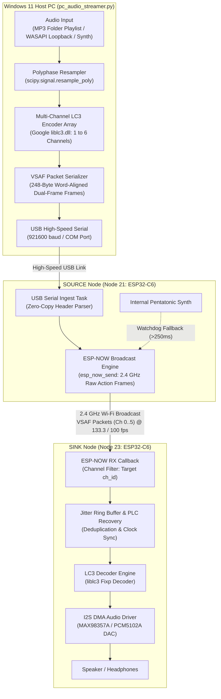

# audioESP-NOW: High-Fidelity Wireless Audio Streaming via ESP-NOW & LC3

`audioESP-NOW` is a low-latency wireless audio streaming system for Espressif ESP32-C6 and ESP32-S3 microcontrollers. It broadcasts compressed, synchronized multi-channel audio over 2.4 GHz Wi-Fi Action Frames using the **Very Low Latency Synchronized Audio Frame (VSAF)** protocol and the **Low Complexity Communication Codec (LC3)**.

The Bluetooth stack is completely disabled in firmware, freeing 100% of the radio and memory resources for real-time Wi-Fi DMA audio streaming.

---

## 1. Key Features

- **Ultra-Low Latency**: End-to-end latency of 15–20 ms from PC audio generation to physical speaker output.
- **LC3 Compression**: Fixed-point psychoacoustic LC3 encoding (Google `liblc3`) providing studio-grade audio quality at low bitrates (64–96 kbps per channel).
- **Flexible Sample Rates**: Dynamic run-time support for **8 kHz, 16 kHz, 24 kHz, 32 kHz, 44.1 kHz, and 48 kHz**.
- **Dual Frame Durations**: Selectable **7.5 ms** (133.3 fps) and **10.0 ms** (100.0 fps) framing with live on-the-fly re-negotiation.
- **In-Band Dual-Frame Redundancy**: Every VSAF packet contains both the current frame ($N$) and previous frame ($N-1$), recovering single isolated packet drops with zero latency without retransmission requests.
- **Microsecond Clock Synchronization**: Presentation Time Stamps (PTS) embedded in packet headers prevent clock drift, DMA buffer underruns, and buffer overflows.
- **Multi-Channel Speaker Addressing**: Broadcasts 1 to 6 discrete channels (Left, Right, Center, LFE, Surround-Left, Surround-Right). SINK nodes filter and play their assigned channel ID (`ch 0..5`) dynamically.
- **Zero-Overhead USB Pass-Through & Autonomous Fallback**:
  - Ingests pre-encoded VSAF packets from a Windows 11 PC over high-speed USB Serial (921600 baud) for `< 4%` CPU utilization on the transmitter.
  - Automatically falls back to an internal on-chip pentatonic tone generator if USB PC streaming pauses for $>250\text{ ms}$, ensuring the wireless network remains active.

---

## 2. System Architecture



For full protocol packet layout, bitfields, and recovery mechanisms, see the [VSAF Protocol Specification](ESP-NOW_protocol.md).

---

## 3. Target Hardware & Pinout

### Tested Hardware Nodes

| Node ID | Role | Board Type | Serial COM Port | Primary Function |
| :--- | :--- | :--- | :--- | :--- |
| **Node 21** | **SOURCE** | [ESP32-C6-WROOM-1](https://www.amazon.se/dp/B0CN66P5XY) (32-pin DevKit) | `COM21` (Flash & Telemetry) / `COM121` (Audio Ingest) | Transmitter / USB Broadcaster |
| **Node 23** | **SINK** | [Waveshare ESP32-C6-Zero](https://www.amazon.se/dp/B0F12PRH9G) (18-pin Mini) | `COM23` (Flash & Logs) | Receiver / I2S DAC Speaker |

### I2S DAC Wiring (SINK Node)

The SINK firmware outputs standard digital audio over I2S to external DAC modules (e.g. **MAX98357A** Class-D Mono Amp or **PCM5102A** Stereo DAC):

| Signal | ESP32-C6-WROOM-1 (Node 21) | ESP32-C6-Zero (Node 23) | MAX98357A / PCM5102A Pin |
| :--- | :--- | :--- | :--- |
| **BCLK** (Bit Clock) | GPIO 20 | GPIO 21 | `BCLK` |
| **WS / LRCK** (Word Select) | GPIO 21 | GPIO 22 | `LRC` / `WS` |
| **DOUT** (Data Out) | GPIO 22 | GPIO 23 | `DIN` |
| **GND** | GND | GND | `GND` |
| **VCC** | 5V / 3.3V | 5V / 3.3V | `VIN` (5V recommended for MAX98357A) |
| **WS2812 RGB LED** | GPIO 8 | GPIO 8 | Onboard status indicator |

---

## 4. Prerequisites & Dependencies

### Hardware Requirements
1. At least two ESP32-C6 development boards (or ESP32-S3 boards).
2. At least one I2S DAC module (e.g., MAX98357A 3.2W Class-D amplifier module).
3. USB cables connecting the nodes to the Windows host PC.

### Software Requirements
1. **ESP-IDF v6.0.2 or newer** installed and configured in your environment (`C:\Espressif\idf-v6.0.2\esp-idf`).
2. **Python 3.10+** (64-bit).
3. **FFmpeg** installed and accessible in the system `PATH` (used by the PC streamer for real-time MP3 decoding):
   ```powershell
   winget install ffmpeg
   ```
4. **Python Dependencies** (installed in project virtual environment `venv_ble_audio`):
   ```powershell
   pip install numpy scipy pyserial sounddevice
   ```

---

## 5. Building & Flashing Firmware

Use the provided PowerShell helper script [`build_and_flash.ps1`](build_and_flash.ps1) to compile and upload firmware with role configuration:

### Flash Node 21 as SOURCE
```powershell
powershell -ExecutionPolicy Bypass -File apps\audioESP-NOW\build_and_flash.ps1 -Role SOURCE -Port COM21
```

### Flash Node 23 as SINK
```powershell
powershell -ExecutionPolicy Bypass -File apps\audioESP-NOW\build_and_flash.ps1 -Role SINK -Port COM23
```

---

## 6. PC Real-Time Audio Streamer (`pc_audio_streamer.py`)

The Windows 11 streaming application captures, resamples, encodes, and transmits multi-channel LC3 audio frames to the SOURCE node over high-speed USB Serial.

### Usage Syntax
```powershell
python apps\audioESP-NOW\pc_audio_streamer.py [OPTIONS]
```

### Command-Line Options

| Option | Type | Default | Description |
| :--- | :--- | :--- | :--- |
| `--port` | `str` | `COM121` | Serial COM port connected to the SOURCE node (e.g. `COM121` or `COM21`). |
| `--baud` | `int` | `921600` | Serial transmission baud rate. |
| `--source` | `choice` | `mp3` | Audio input source: `mp3`, `wasapi`, `synth`, or `device`. |
| `--mp3-dir` | `str` | `data/mp3` | Directory containing `.mp3`, `.wav`, or `.flac` audio files for the playlist. |
| `--sample-rate` | `int` | `48000` | Audio sampling frequency in Hz: `8000`, `16000`, `24000`, `32000`, `44100`, `48000`. |
| `--duration` | `float` | `7.5` | LC3 frame duration in milliseconds: `7.5` (133.3 fps) or `10.0` (100.0 fps). |
| `--channels` | `int` | `2` | Number of audio channels to stream (1 to 6). |
| `--octets` | `int` | `0` | LC3 octets per frame per channel (`0` = automatic bitrate preset). |
| `--device` | `str` | `None` | Partial name or index query for WASAPI audio capture device. |
| `--test-duration` | `float` | `None` | Auto-stop streaming after N seconds (useful for automated testing). |

---

### Example Commands

#### 1. Stream Random MP3 Tracks from `data/mp3` (Default)
Streams CD/Studio-quality audio at 48 kHz, 7.5 ms frame duration, Stereo:
```powershell
& "C:\Git_ble_audio\venv_ble_audio\Scripts\python.exe" apps\audioESP-NOW\pc_audio_streamer.py --port COM121 --source mp3 --sample-rate 48000 --duration 7.5 --channels 2
```

#### 2. Stream Live Windows 11 System Audio (WASAPI Loopback)
Captures all desktop audio (YouTube, Spotify, games) and broadcasts wirelessly in real-time:
```powershell
& "C:\Git_ble_audio\venv_ble_audio\Scripts\python.exe" apps\audioESP-NOW\pc_audio_streamer.py --port COM121 --source wasapi --sample-rate 48000 --duration 7.5 --channels 2
```

#### 3. Stream 6-Channel Multi-Speaker Audio
Streams 6 discrete audio channels at 32 kHz, 10.0 ms frame duration:
```powershell
& "C:\Git_ble_audio\venv_ble_audio\Scripts\python.exe" apps\audioESP-NOW\pc_audio_streamer.py --port COM121 --source mp3 --sample-rate 32000 --duration 10.0 --channels 6
```

---

## 7. Interactive Serial Console Commands

While nodes are running, you can send ASCII commands directly over their USB Serial monitor at 115200 baud to change runtime configuration:

| Command | Target | Description | Example |
| :--- | :--- | :--- | :--- |
| `ch <0..5>` | SINK | Changes the active audio channel the speaker listens to. | `ch 1` (Switch to Right channel) |
| `rate <Hz>` | SOURCE | Changes the stream sampling rate dynamically. | `rate 44100` |
| `dur <ms>` | SOURCE | Switches frame duration dynamically between 7.5 and 10.0 ms. | `dur 7.5` |
| `magic <word>` | BOTH | Sets the network isolation magic filter word (default `0x1337`). | `magic 0x1337` |
| `drop` | SOURCE | Simulates dropping a single packet to test in-band recovery. | `drop` |

---

## 8. Status LED Indications (WS2812 RGB)

The onboard WS2812 RGB LED communicates real-time network states:

| Color | State | Description |
| :--- | :--- | :--- |
| **Solid Blue** | `BROADCASTING` | SOURCE node is actively transmitting audio packets over ESP-NOW. |
| **Solid Green** | `PLAYING` | SINK node is synchronized and outputting audio via I2S DMA. |
| **Flashing Yellow** | `PREFILL` | SINK node is buffering initial frames before starting playback. |
| **Flashing Blue** | `SCANNING` | SINK node is waiting for a valid SOURCE broadcast on the channel. |
| **Solid Magenta** | `IDLE` | Node initialized in Standby / Idle mode. |
| **Solid Red** | `ERROR` | Hardware initialization or DMA driver fault. |

---

## 9. Telemetry & Diagnostics

Every second, nodes output a structured ANSI telemetry block over the serial console:

```text
I (46620) : ========== [ESP32-C6-23] ==========
I (46620) [SYS]: CPU 12% @ 160 MHz | Temp 37 C | Heap 281 KB | MasterTime 16188 ms
I (46620) [ESPNOW]: SINK | PLAYING [Ch 0] | 1800 total pkts (133.3 pkts/s) | RSSI -26 dBm | SyncAdj 24 | Magic 0x1337
I (46630) [AUDIO]: RMS|Pk -38.2|-22.1 dBFS | DMA_UDR 0 | FIFO_OV/UD 0/0 | PLC 0 | PREV_REC 0 | Stereo 16-bit 48.0 kHz
```

Key metrics to monitor:
- **`DMA_UDR`**: I2S DMA underrun counter (should remain 0).
- **`FIFO_OV/UD`**: Jitter ring buffer overflow/underflow counter (should remain 0/0).
- **`PLC`**: Packet Loss Concealment invocations.
- **`PREV_REC`**: In-band recovered packets using the dual-frame $N-1$ payload.

---

## 10. Automated Test Suite

Run the full end-to-end hardware regression test suite using:
```powershell
powershell -ExecutionPolicy Bypass -File apps\audioESP-NOW\run_automated_tests.ps1
```

This verifies magic word rejection, startup state transitions, stream re-connection, microsecond clock synchronization, packet drop recovery, 7.5 ms / 10.0 ms live transitions, and sustained audio streaming stability.

---

## 11. License

This project is licensed under the **GNU Affero General Public License v3.0 (AGPL-3.0-or-later)**. See the root [`LICENSE`](../../LICENSE) file for details.
