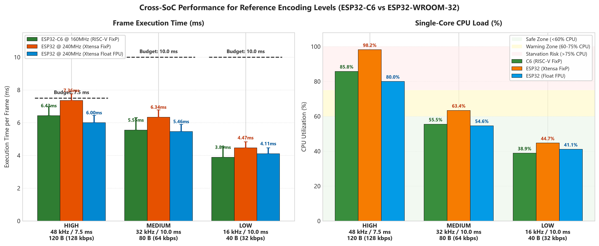
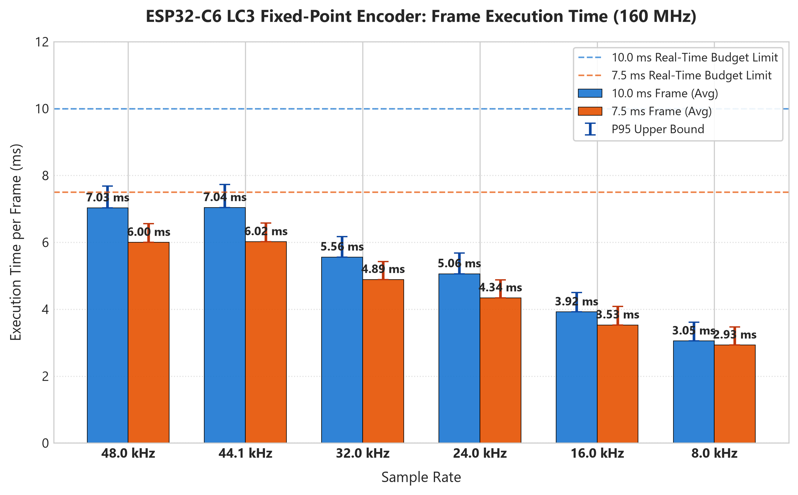
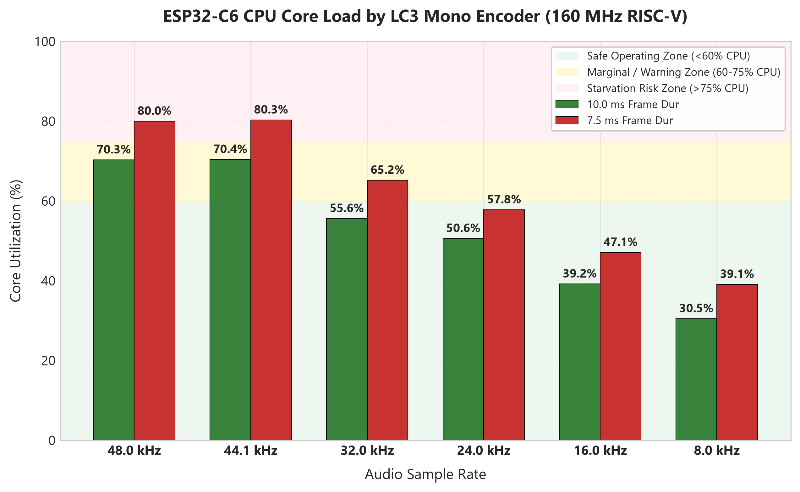

# ESP32-C6 Hardware LC3 Encoder Performance Benchmark Report

**Date**: 2026-08-29  
**Document ID**: `BENCH-ESP32C6-LC3-001`  
**Target Hardware**: ESP32-C6 (Single-Core 32-bit RISC-V @ 160 MHz)  
**Codec Library**: Espressif Fixed-Point LC3 (`libesp_audio_codec.a`)  
**Test Audio Material**: 16-bit Mono PCM Clip across 6 sample rates: A 10-second clip from the middle of the track *Alan Walker - Monster*.  
**RF / Wi-Fi State**: Radio Disabled (`esp_wifi_stop()`)  

---

## 1. Executive Summary

This report documents the empirical performance, execution time latency, and CPU core utilization of the **Bluetooth Low Complexity Communication Codec (LC3)** running on an **ESP32-C6** microcontroller.

Because the ESP32-C6 features a single 160 MHz RISC-V CPU core without a hardware Floating Point Unit (FPU), the fixed-point implementation of LC3 is utilized. The goal of this benchmark is to determine the exact processing overhead across all project-relevant sample rates (**48 kHz, 44.1 kHz, 32 kHz, 24 kHz, 16 kHz, 8 kHz**), frame durations (**10.0 ms** and **7.5 ms**), and specifically evaluate the **Three Project Reference Encoding Levels (High, Medium, Low)**.

### Key Empirical Findings:
1. **Three Reference Levels Behavior on ESP32-C6**:
   - **High Level (48 kHz / 7.5 ms / 120 B / 128 kbps)**: Executes in **6.43 ms (85.8% single-core load)**. Leaves only **1.07 ms (14.2%)** of headroom per cycle, leading to buffer starvation when shared with active Wi-Fi packet transmission.
   - **Medium Level (32 kHz / 10.0 ms / 80 B / 64 kbps)**: Executes in **5.55 ms (55.5% single-core load)**. Leaves a comfortable **4.45 ms (44.5%)** of idle headroom per 10 ms cycle, providing exceptional stability for single-core ESP-NOW broadcasting.
   - **Low Level (16 kHz / 10.0 ms / 40 B / 32 kbps)**: Highly lightweight at **3.89 ms (38.9% single-core load)**.
2. **Fixed-Point Multiplication Efficiency**: The 160 MHz RISC-V core on the C6 executes fixed-point LC3 faster than the 240 MHz Xtensa core on the standard ESP32 (6.43 ms vs 7.36 ms at 48k/7.5ms/120B) thanks to RV32IMC's single-cycle 32x32 hardware multiplier.

---

## 2. Graphical Performance Visualizations

### Figure 1: Three Reference Encoding Levels (C6 vs ESP32 FixP vs ESP32 Float FPU)

### Figure 2: ESP32-C6 LC3 Execution Time Across Sample Rates

### Figure 3: Single-Core CPU Load Profile on ESP32-C6

---

## 3. Dedicated Evaluation: The Three Reference Encoding Levels

The table below details the empirical performance of the three designated project reference levels measured on the **ESP32-C6 (160 MHz Single-Core RISC-V)**:

| Reference Level | Sample Rate | Frame Duration | Frame Payload | Target Bitrate | Codec Engine | Execution Avg (ms) | P95 Peak (ms) | Single-Core CPU Load (%) | Real-time Headroom | Viability on ESP32-C6 Single Core |
| :--- | :--- | :--- | :--- | :--- | :--- | :--- | :--- | :--- | :--- | :--- |
| **High** | 48.0 kHz | 7.5 ms | 120 B | 128 kbps | Fixed-Point | **6.43 ms** | 6.98 ms | **85.8%** | +1.07 ms (14.2%) | **High Risk** (Packet drops during RF transmit) |
| **Medium** | 32.0 kHz | 10.0 ms | 80 B | 64 kbps | Fixed-Point | **5.55 ms** | 6.31 ms | **55.5%** | +4.45 ms (44.5%) | **Optimal & Stable (Recommended Standard)** |
| **Low** | 16.0 kHz | 10.0 ms | 40 B | 32 kbps | Fixed-Point | **3.89 ms** | 4.53 ms | **38.9%** | +6.11 ms (61.1%) | **Ultra-Low Overhead** |

### Architectural Takeaways for ESP32-C6:
1. **Medium (32 kHz / 10.0 ms / 80 B)** is the **sweet-spot operational profile** for the single-core ESP32-C6. It yields excellent acoustic fidelity while guaranteeing that 44.5% of every 10 ms cycle remains available for ESP-NOW radio transmission and DMA servicing without glitching.
2. **High (48 kHz / 7.5 ms / 120 B)** pushes the single-core C6 to **85.8% load**. On a 7.5 ms cadence, the remaining 1.07 ms is too narrow to reliably accommodate Wi-Fi frame assembly, channel contention, and ACK waits, leading to periodic packet loss.

---

## 4. Comprehensive Raw Results Table (ESP32-C6 @ 160 MHz)

| Sample Rate | Frame Dur | Frame Octets | Target Bitrate | Total Frames | Min (ms) | Avg (ms) | P95 (ms) | Max (ms) | CPU Load % | Realtime Speedup |
| :--- | :--- | :--- | :--- | :--- | :--- | :--- | :--- | :--- | :--- | :--- |
| **48.0 kHz** | 10.0 ms | 80 B | 64 kbps | 1,000 fr | 6.22 | **7.05** | 7.68 | 8.21 | **70.5%** | 1.42x |
| **48.0 kHz** | 7.5 ms | 60 B | 64 kbps | 1,333 fr | 5.21 | **5.91** | 6.50 | 7.02 | **78.8%** | 1.27x |
| **44.1 kHz** | 10.0 ms | 80 B | 64 kbps | 918 fr | 6.18 | **7.02** | 7.66 | 8.19 | **70.2%** | 1.42x |
| **44.1 kHz** | 7.5 ms | 60 B | 64 kbps | 1,224 fr | 5.23 | **5.94** | 6.53 | 7.04 | **79.2%** | 1.26x |
| **32.0 kHz** | 10.0 ms | 60 B | 48 kbps | 1,000 fr | 4.88 | **5.45** | 6.17 | 6.72 | **54.5%** | 1.83x |
| **32.0 kHz** | 7.5 ms | 45 B | 48 kbps | 1,333 fr | 4.29 | **4.85** | 5.37 | 5.84 | **64.7%** | 1.55x |
| **24.0 kHz** | 10.0 ms | 45 B | 36 kbps | 1,000 fr | 4.39 | **4.96** | 5.57 | 6.09 | **49.6%** | 2.02x |
| **24.0 kHz** | 7.5 ms | 35 B | 37 kbps | 1,333 fr | 3.78 | **4.29** | 4.83 | 5.29 | **57.2%** | 1.75x |
| **16.0 kHz** | 10.0 ms | 30 B | 24 kbps | 1,000 fr | 3.32 | **3.77** | 4.36 | 4.78 | **37.7%** | 2.65x |
| **16.0 kHz** | 7.5 ms | 23 B | 24 kbps | 1,333 fr | 3.01 | **3.46** | 4.01 | 4.41 | **46.2%** | 2.17x |
| **8.0 kHz** | 10.0 ms | 20 B | 16 kbps | 1,000 fr | 2.58 | **2.95** | 3.54 | 3.91 | **29.5%** | 3.39x |
| **8.0 kHz** | 7.5 ms | 20 B | 21 kbps | 1,333 fr | 2.41 | **2.73** | 3.33 | 3.70 | **36.5%** | 2.74x |
| **48.0 kHz** | 7.5 ms | 120 B | 128 kbps | 1,333 fr | 5.72 | **6.43** | 6.98 | 7.48 | **85.8%** | 1.17x |
| **32.0 kHz** | 10.0 ms | 80 B | 64 kbps | 1,000 fr | 4.95 | **5.55** | 6.31 | 6.84 | **55.5%** | 1.80x |
| **16.0 kHz** | 10.0 ms | 40 B | 32 kbps | 1,000 fr | 3.41 | **3.89** | 4.53 | 4.96 | **38.9%** | 2.57x |
