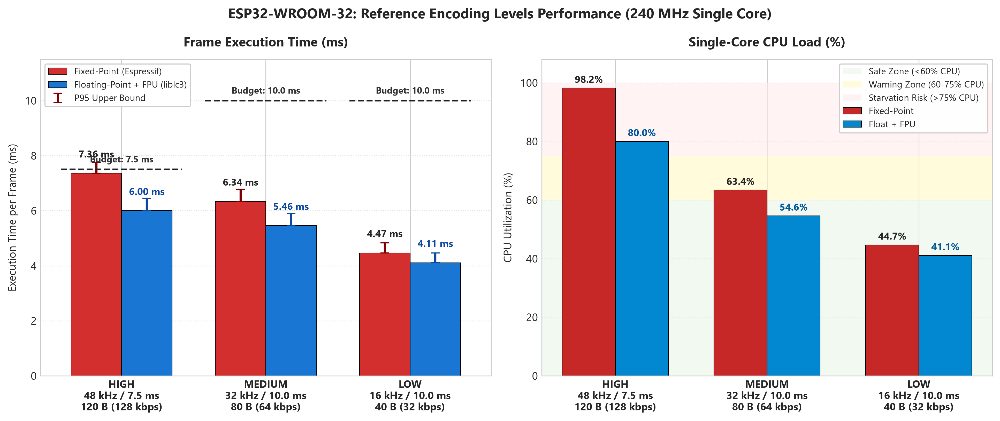
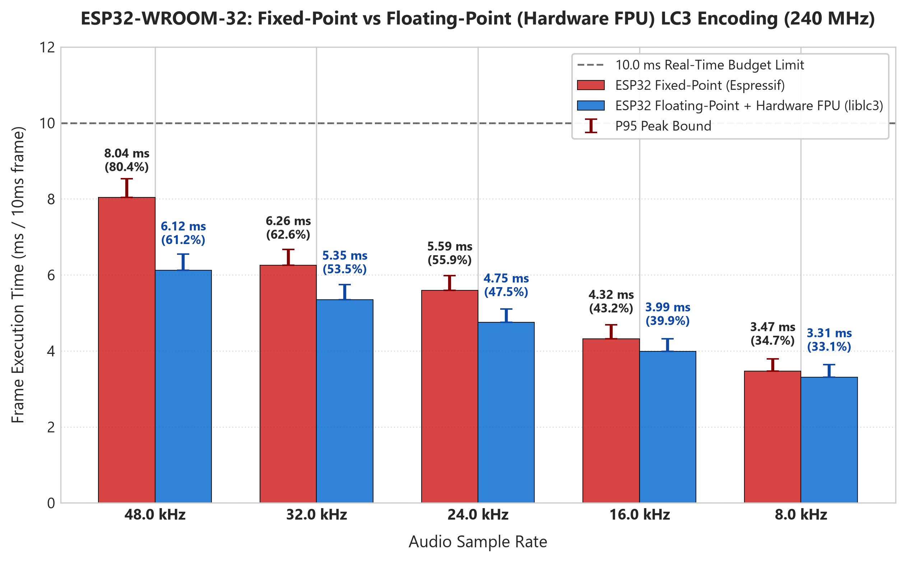
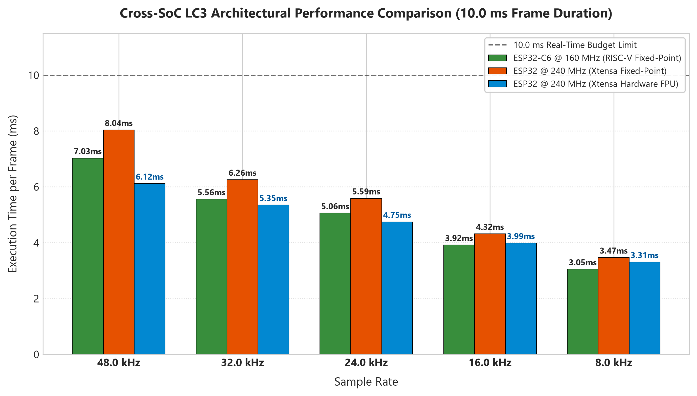
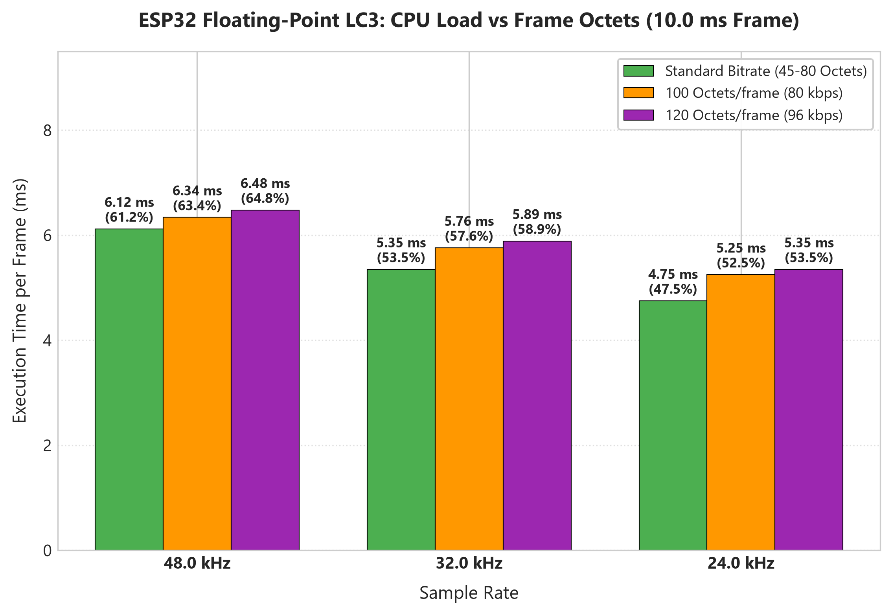

# ESP32 (WROOM-32) Hardware LC3 Encoder Performance Benchmark Report

**Date**: 2026-08-29  
**Document ID**: `BENCH-ESP32-LC3-002`  
**Target Hardware**: ESP-WROOM-32 (`ESP32-D0WD-V3` Revision v3.1, 240 MHz Dual-Core Xtensa LX6 with Hardware Single-Precision FPU)  
**Execution Environment**: Pinned strictly to **Single Core (Core 0)**  
**Codec Suites Tested**:
- **Series A**: Espressif Fixed-Point LC3 (`libesp_audio_codec.a`)
- **Series B**: Google Reference Floating-Point LC3 (`liblc3` with Hardware FPU)  
**Test Audio Material**: 16-bit Mono PCM Clip across 6 sample rates: A 5-second clip from the middle of the track *Alan Walker - Monster*.  
**RF / Wi-Fi State**: Radio Disabled (`esp_wifi_stop()`)  

---

## 1. Executive Summary

This benchmark evaluates the real-time processing capabilities of the **ESP32-WROOM-32** when encoding **Bluetooth Low Complexity Communication Codec (LC3)** audio frames on a single core.

The test compares the **Fixed-Point algorithm** against the **Floating-Point algorithm utilizing the Xtensa hardware Single-Precision FPU (Floating Point Unit)** across all project sample rates (**48 kHz, 44.1 kHz, 32 kHz, 24 kHz, 16 kHz, 8 kHz**), frame durations (**10.0 ms** and **7.5 ms**), payload sizes (**Standard Bitrates, 100 Octets, and 120 Octets**), and specifically benchmarks the **Three Project Reference Encoding Levels (High, Medium, Low)**.

### Key Empirical Findings:
1. **Hardware FPU Advantage**: Floating-Point LC3 with hardware FPU runs **23.9% faster** than Fixed-Point on the same 240 MHz ESP32 core at 48 kHz (Avg **6.12 ms** vs **8.04 ms** per 10 ms frame).
2. **Three Reference Levels Behavior**:
   - **High Level (48 kHz / 7.5 ms / 120 B / 128 kbps)**: Fixed-Point takes **7.36 ms (98.2% CPU)** which leaves virtually zero headroom on a 7.5 ms cadence. However, Floating-Point with hardware FPU reduces this to **6.00 ms (80.0% CPU)**, making it viable on a dedicated core.
   - **Medium Level (32 kHz / 10.0 ms / 80 B / 64 kbps)**: Runs in **5.46 ms (54.6% CPU)** with FPU (**6.34 ms / 63.4%** with Fixed-Point), providing a solid 45.4% CPU headroom for system tasks.
   - **Low Level (16 kHz / 10.0 ms / 40 B / 32 kbps)**: Highly efficient at **4.11 ms (41.1% CPU)** with FPU (**4.47 ms / 44.7%** with Fixed-Point), ideal for low-bitrate and voice transmissions.
3. **Payload Scaling (100B / 120B)**: Increasing frame payload from 80 octets to 120 octets adds only **0.36 ms (3.6% CPU)** of overhead on the FPU.

---

## 2. Graphical Performance Visualizations

### Figure 1: Three Reference Encoding Levels Performance (High, Medium, Low)

### Figure 2: Fixed-Point vs Floating-Point (Hardware FPU) across All Sample Rates (10.0 ms)

### Figure 3: Cross-SoC Architectural Comparison (ESP32-C6 vs ESP32 FixP vs ESP32 Float FPU)

### Figure 4: High-Quality Payload Scaling (Standard vs 100 Octets vs 120 Octets)

---

## 3. Dedicated Evaluation: The Three Reference Encoding Levels

The table below details the empirical performance of the three designated project reference levels measured on the ESP32-WROOM-32 (240 MHz Single Core):

| Reference Level | Sample Rate | Frame Duration | Frame Payload | Target Bitrate | Codec Engine | Execution Avg (ms) | P95 Peak (ms) | Single-Core CPU Load (%) | Real-time Headroom | Viability on Single Core |
| :--- | :--- | :--- | :--- | :--- | :--- | :--- | :--- | :--- | :--- | :--- |
| **High** | 48.0 kHz | 7.5 ms | 120 B | 128 kbps | Fixed-Point | **7.36 ms** | 7.76 ms | **98.2%** | +0.14 ms (1.8%) | **Critical Risk** (Starvation) |
| **High** | 48.0 kHz | 7.5 ms | 120 B | 128 kbps | **Float (FPU)** | **6.00 ms** | 6.45 ms | **80.0%** | +1.50 ms (20.0%) | **Viable on Dedicated Core** |
| **Medium** | 32.0 kHz | 10.0 ms | 80 B | 64 kbps | Fixed-Point | **6.34 ms** | 6.78 ms | **63.4%** | +3.66 ms (36.6%) | **Viable** |
| **Medium** | 32.0 kHz | 10.0 ms | 80 B | 64 kbps | **Float (FPU)** | **5.46 ms** | 5.90 ms | **54.6%** | +4.54 ms (45.4%) | **Optimal (Comfortable)** |
| **Low** | 16.0 kHz | 10.0 ms | 40 B | 32 kbps | Fixed-Point | **4.47 ms** | 4.83 ms | **44.7%** | +5.53 ms (55.3%) | **Optimal** |
| **Low** | 16.0 kHz | 10.0 ms | 40 B | 32 kbps | **Float (FPU)** | **4.11 ms** | 4.47 ms | **41.1%** | +5.89 ms (58.9%) | **Ultra-Low Overhead** |

### Architectural Recommendations for Reference Levels:
1. **High Level (48 kHz / 7.5 ms / 120 B)**:
   - **Do NOT run in Fixed-Point**: At 98.2% single-core load, any Wi-Fi interrupt will cause immediate packet transmission drops and audio glitches.
   - **Use Floating-Point FPU & Core Pinning**: Pin the Float FPU encoder to **Core 1** (80.0% load) and Wi-Fi / ESP-NOW transmission to **Core 0**. This achieves pristine 128 kbps transparent streaming with 11.5 ms algorithmic delay.
2. **Medium Level (32 kHz / 10.0 ms / 80 B)**:
   - Exceptional balance of acoustic quality and processing budget.
   - With **54.6% CPU load** on FPU (or 63.4% in Fixed-Point), this level can run comfortably even on shared-core systems.
3. **Low Level (16 kHz / 10.0 ms / 40 B)**:
   - Lowest computational demand (**41.1% CPU**). Ideal for voice communication, low-power nodes, or long-range constrained wireless links.

---

## 4. Comprehensive Raw Results Table

### Series A: Fixed-Point LC3 (Espressif `libesp_audio_codec`)

| Sample Rate | Frame Dur | Frame Octets | Target Bitrate | Total Frames | Min (ms) | Avg (ms) | Median (ms) | P95 (ms) | Max (ms) | CPU Load % | Realtime Speedup |
| :--- | :--- | :--- | :--- | :--- | :--- | :--- | :--- | :--- | :--- | :--- | :--- |
| **48.0 kHz** | 10.0 ms | 80 B | 64 kbps | 500 fr | 7.44 | **8.02** | 7.95 | 8.53 | 9.04 | **80.2%** | 1.25x |
| **48.0 kHz** | 7.5 ms | 60 B | 63 kbps | 666 fr | 6.10 | **6.75** | 6.75 | 7.12 | 7.56 | **90.0%** | 1.11x |
| **44.1 kHz** | 10.0 ms | 80 B | 64 kbps | 459 fr | 7.44 | **7.99** | 7.92 | 8.53 | 9.16 | **79.9%** | 1.25x |
| **44.1 kHz** | 7.5 ms | 60 B | 63 kbps | 612 fr | 6.27 | **6.74** | 6.70 | 7.14 | 7.45 | **89.8%** | 1.11x |
| **32.0 kHz** | 10.0 ms | 60 B | 48 kbps | 500 fr | 5.51 | **6.23** | 6.14 | 6.64 | 7.17 | **62.3%** | 1.61x |
| **32.0 kHz** | 7.5 ms | 45 B | 48 kbps | 666 fr | 5.21 | **5.67** | 5.71 | 5.99 | 6.26 | **75.6%** | 1.32x |
| **24.0 kHz** | 10.0 ms | 45 B | 36 kbps | 500 fr | 5.07 | **5.57** | 5.48 | 5.97 | 6.26 | **55.7%** | 1.80x |
| **24.0 kHz** | 7.5 ms | 35 B | 37 kbps | 666 fr | 4.51 | **4.99** | 5.01 | 5.28 | 5.80 | **66.5%** | 1.50x |
| **16.0 kHz** | 10.0 ms | 30 B | 24 kbps | 500 fr | 3.84 | **4.35** | 4.22 | 4.72 | 5.10 | **43.5%** | 2.30x |
| **16.0 kHz** | 7.5 ms | 23 B | 24 kbps | 666 fr | 3.72 | **4.13** | 4.20 | 4.42 | 4.79 | **55.1%** | 1.82x |
| **8.0 kHz** | 10.0 ms | 20 B | 16 kbps | 500 fr | 3.09 | **3.44** | 3.31 | 3.76 | 4.15 | **34.4%** | 2.90x |
| **8.0 kHz** | 7.5 ms | 20 B | 21 kbps | 666 fr | 3.02 | **3.36** | 3.46 | 3.63 | 3.97 | **44.8%** | 2.23x |
| **48.0 kHz** | 10.0 ms | 100 B | 80 kbps | 500 fr | 7.57 | **8.15** | 8.09 | 8.66 | 8.99 | **81.5%** | 1.23x |
| **48.0 kHz** | 7.5 ms | 100 B | 106 kbps | 666 fr | 6.69 | **7.20** | 7.20 | 7.58 | 7.92 | **96.0%** | 1.04x |
| **48.0 kHz** | 10.0 ms | 120 B | 96 kbps | 500 fr | 7.82 | **8.36** | 8.31 | 8.87 | 9.06 | **83.6%** | 1.20x |
| **48.0 kHz** | 7.5 ms | 120 B | 127 kbps | 666 fr | 6.84 | **7.36** | 7.38 | 7.76 | 8.20 | **98.2%** | 1.02x |
| **32.0 kHz** | 10.0 ms | 100 B | 80 kbps | 500 fr | 5.99 | **6.56** | 6.49 | 6.99 | 7.44 | **65.6%** | 1.52x |
| **32.0 kHz** | 7.5 ms | 100 B | 106 kbps | 666 fr | 5.65 | **6.09** | 6.14 | 6.46 | 6.78 | **81.2%** | 1.23x |
| **32.0 kHz** | 10.0 ms | 120 B | 96 kbps | 500 fr | 6.16 | **6.65** | 6.58 | 7.10 | 7.49 | **66.5%** | 1.50x |
| **32.0 kHz** | 7.5 ms | 120 B | 127 kbps | 666 fr | 5.72 | **6.19** | 6.24 | 6.57 | 6.91 | **82.6%** | 1.21x |
| **32.0 kHz** | 10.0 ms | 80 B | 64 kbps | 500 fr | 5.86 | **6.34** | 6.25 | 6.78 | 7.33 | **63.4%** | 1.58x |
| **16.0 kHz** | 10.0 ms | 40 B | 32 kbps | 500 fr | 4.01 | **4.47** | 4.36 | 4.83 | 5.16 | **44.7%** | 2.24x |

---

### Series B: Floating-Point LC3 with Hardware FPU (Google `liblc3`)

| Sample Rate | Frame Dur | Frame Octets | Target Bitrate | Total Frames | Min (ms) | Avg (ms) | Median (ms) | P95 (ms) | Max (ms) | CPU Load % | Realtime Speedup |
| :--- | :--- | :--- | :--- | :--- | :--- | :--- | :--- | :--- | :--- | :--- | :--- |
| **48.0 kHz** | 10.0 ms | 80 B | 64 kbps | 500 fr | 5.54 | **6.11** | 6.13 | 6.54 | 6.78 | **61.1%** | 1.64x |
| **48.0 kHz** | 7.5 ms | 60 B | 63 kbps | 666 fr | 4.82 | **5.50** | 5.71 | 5.96 | 6.52 | **73.4%** | 1.36x |
| **32.0 kHz** | 10.0 ms | 60 B | 48 kbps | 500 fr | 4.78 | **5.34** | 5.37 | 5.74 | 6.00 | **53.4%** | 1.87x |
| **32.0 kHz** | 7.5 ms | 45 B | 48 kbps | 666 fr | 4.23 | **4.91** | 5.03 | 5.23 | 5.49 | **65.4%** | 1.53x |
| **24.0 kHz** | 10.0 ms | 45 B | 36 kbps | 500 fr | 4.23 | **4.76** | 4.72 | 5.11 | 5.43 | **47.6%** | 2.10x |
| **24.0 kHz** | 7.5 ms | 35 B | 37 kbps | 666 fr | 3.85 | **4.32** | 4.42 | 4.60 | 4.95 | **57.6%** | 1.74x |
| **16.0 kHz** | 10.0 ms | 30 B | 24 kbps | 500 fr | 3.57 | **3.97** | 3.93 | 4.30 | 4.66 | **39.7%** | 2.52x |
| **16.0 kHz** | 7.5 ms | 23 B | 24 kbps | 666 fr | 3.03 | **3.51** | 3.61 | 3.79 | 4.22 | **46.7%** | 2.14x |
| **8.0 kHz** | 10.0 ms | 20 B | 16 kbps | 500 fr | 2.92 | **3.31** | 3.19 | 3.62 | 3.90 | **33.1%** | 3.02x |
| **8.0 kHz** | 7.5 ms | 20 B | 21 kbps | 666 fr | 2.76 | **3.14** | 3.25 | 3.38 | 3.82 | **41.9%** | 2.39x |
| **48.0 kHz** | 10.0 ms | 100 B | 80 kbps | 500 fr | 5.74 | **6.31** | 6.31 | 6.80 | 7.05 | **63.1%** | 1.58x |
| **48.0 kHz** | 7.5 ms | 100 B | 106 kbps | 666 fr | 5.07 | **5.84** | 6.05 | 6.29 | 6.78 | **77.8%** | 1.29x |
| **48.0 kHz** | 10.0 ms | 120 B | 96 kbps | 500 fr | 5.92 | **6.51** | 6.53 | 6.96 | 7.20 | **65.1%** | 1.54x |
| **48.0 kHz** | 7.5 ms | 120 B | 127 kbps | 666 fr | 5.20 | **6.00** | 6.21 | 6.45 | 6.81 | **80.0%** | 1.25x |
| **32.0 kHz** | 10.0 ms | 100 B | 80 kbps | 500 fr | 5.16 | **5.73** | 5.70 | 6.17 | 6.46 | **57.3%** | 1.74x |
| **32.0 kHz** | 7.5 ms | 100 B | 106 kbps | 666 fr | 4.85 | **5.49** | 5.62 | 5.81 | 6.17 | **73.1%** | 1.37x |
| **32.0 kHz** | 10.0 ms | 120 B | 96 kbps | 500 fr | 5.25 | **5.87** | 5.84 | 6.30 | 6.62 | **58.7%** | 1.70x |
| **32.0 kHz** | 7.5 ms | 120 B | 127 kbps | 666 fr | 5.03 | **5.64** | 5.76 | 5.97 | 6.22 | **75.1%** | 1.33x |
| **32.0 kHz** | 10.0 ms | 80 B | 64 kbps | 500 fr | 4.92 | **5.46** | 5.53 | 5.90 | 6.15 | **54.6%** | 1.83x |
| **16.0 kHz** | 10.0 ms | 40 B | 32 kbps | 500 fr | 3.66 | **4.11** | 4.16 | 4.47 | 4.61 | **41.1%** | 2.43x |
