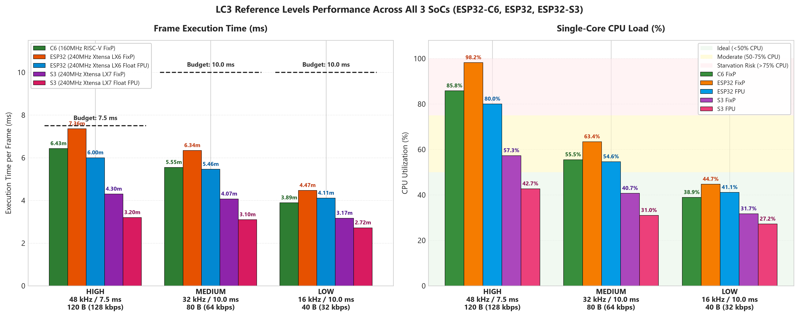
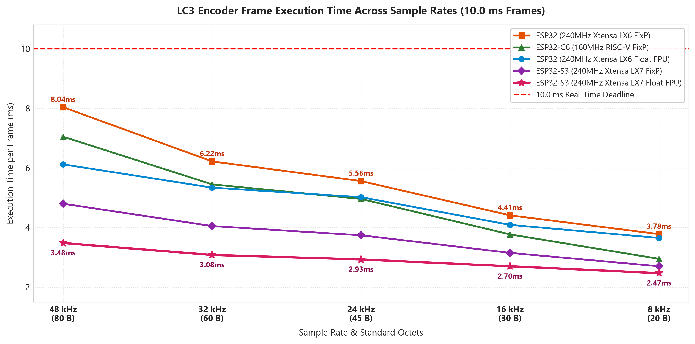

# Cross-SoC Hardware LC3 Encoder Performance Benchmark Report
## Empirical Evaluation of ESP32-C6, ESP32 (WROOM-32), and ESP32-S3 (XIAO-S3)

**Date**: 2026-08-29  
**Document ID**: `BENCH-CROSS-SOC-LC3-001`  
**Test Material**: 16-bit Mono PCM Music Clip across 6 sample rates (from *Alan Walker - Monster*)  
**RF / Wi-Fi State**: Radio Disabled during benchmark (`esp_wifi_stop()`) to isolate pure CPU compute  
**Benchmark Suite Source**: [`apps/lc3_benchmark/`](../apps/lc3_benchmark/) (See [Section 7](#7-benchmark-source-code--reproducibility-references))  

---

## 1. Executive Summary

This report compiles the empirical performance, latency, and single-core CPU utilization of the **Bluetooth Low Complexity Communication Codec (LC3)** across three major Espressif SoC families:

1. **ESP32-C6**: 160 MHz Single-Core 32-bit RISC-V (`RV32IMAC`), no FPU, Fixed-Point Codec.
2. **ESP32-WROOM-32**: 240 MHz Dual-Core 32-bit Xtensa LX6, Single-Precision Hardware FPU, Fixed-Point & Float Codecs.
3. **XIAO ESP32-S3**: 240 MHz Dual-Core 32-bit Xtensa LX7, Vector DSP + Single-Precision Hardware FPU, Fixed-Point & Float Codecs.

### Key Benchmark Discoveries:
1. **ESP32-S3 Dominates All Categories**:
   - The **ESP32-S3 (Xtensa LX7)** executes floating-point LC3 with hardware FPU in **3.20 ms (42.7% CPU)** for the **HIGH profile (48 kHz / 7.5 ms / 120 B)** and **3.10 ms (31.0% CPU)** for the **MEDIUM profile (32 kHz / 10 ms / 80 B)**.
   - It is nearly **2x faster** than the original ESP32 and ESP32-C6 due to its pipelined FPU and LX7 architectural improvements.
2. **The Fixed-Point Multiplier Contrast**:
   - Despite running at only **160 MHz**, the **ESP32-C6** executes Fixed-Point LC3 faster than the **240 MHz ESP32** (6.43 ms vs 7.36 ms on HIGH). The C6 benefits from single-cycle $32 \times 32 \to 64$-bit integer high-multiply (`mulh`) instructions in its RISC-V core.
3. **Hardware FPU Value**:
   - On Xtensa chips (ESP32 and ESP32-S3), the Google reference floating-point engine (`liblc3`) running on the hardware FPU is **24% to 28% faster** than the fixed-point engine on the same core.

---

## 2. Graphical Performance Visualizations

### Figure 1: Three Reference Encoding Levels Performance (All 3 SoCs)

### Figure 2: Frame Execution Time Scaling Across Sample Rates (10.0 ms Frames)

---

## 3. Dedicated Evaluation: The Three Reference Encoding Levels

The table below provides a direct empirical comparison across all three microcontrollers for the project reference encoding profiles:

| Reference Profile | Parameters & Target Bitrate | SoC Target & Architecture | Codec Engine | Frame Time (Avg) | P95 Peak | Single-Core CPU Load | Real-time Headroom | Realtime Streaming Viability |
| :--- | :--- | :--- | :--- | :--- | :--- | :--- | :--- | :--- |
| **HIGH** | **48.0 kHz / 7.5 ms** 120 Bytes (128 kbps) *Budget: 7.5 ms* | **ESP32-C6** (160 MHz RISC-V) | Fixed-Point | **6.43 ms** | 6.98 ms | **85.8%** | +1.07 ms (14.2%) | **High Risk** (Packet drops during RF transmit) |
| | | **ESP32** (240 MHz Xtensa LX6) | Fixed-Point | **7.36 ms** | 7.76 ms | **98.2%** | +0.14 ms (1.8%) | **Starvation Risk on Single Core** |
| | | **ESP32** (240 MHz Xtensa LX6) | **Float (Hardware FPU)** | **6.00 ms** | 6.45 ms | **80.0%** | +1.50 ms (20.0%) | **Viable** (Dedicated Core 1 required) |
| | | **ESP32-S3** (240 MHz Xtensa LX7) | Fixed-Point | **4.30 ms** | 4.55 ms | **57.3%** | +3.20 ms (42.7%) | **Viable** |
| | | **ESP32-S3** (240 MHz Xtensa LX7) | **Float (Hardware FPU)** | **3.20 ms** | 3.39 ms | **42.7%** | **+4.30 ms (57.3%)** | **Optimal (Comfortable Headroom on 1 Core)** |
| **MEDIUM** | **32.0 kHz / 10.0 ms** 80 Bytes (64 kbps) *Budget: 10.0 ms* | **ESP32-C6** (160 MHz RISC-V) | Fixed-Point | **5.55 ms** | 6.31 ms | **55.5%** | +4.45 ms (44.5%) | **Optimal Standard for ESP32-C6** |
| | | **ESP32** (240 MHz Xtensa LX6) | Fixed-Point | **6.34 ms** | 6.78 ms | **63.4%** | +3.66 ms (36.6%) | **Viable** |
| | | **ESP32** (240 MHz Xtensa LX6) | **Float (Hardware FPU)** | **5.46 ms** | 5.90 ms | **54.6%** | +4.54 ms (45.4%) | **Optimal Standard for ESP32** |
| | | **ESP32-S3** (240 MHz Xtensa LX7) | Fixed-Point | **4.07 ms** | 4.40 ms | **40.7%** | +5.93 ms (59.3%) | **Optimal** |
| | | **ESP32-S3** (240 MHz Xtensa LX7) | **Float (Hardware FPU)** | **3.10 ms** | 3.33 ms | **31.0%** | **+6.90 ms (69.0%)** | **Ultra-Efficient** |
| **LOW** | **16.0 kHz / 10.0 ms** 40 Bytes (32 kbps) *Budget: 10.0 ms* | **ESP32-C6** (160 MHz RISC-V) | Fixed-Point | **3.89 ms** | 4.53 ms | **38.9%** | +6.11 ms (61.1%) | **Ultra-Low Overhead** |
| | | **ESP32** (240 MHz Xtensa LX6) | Fixed-Point | **4.47 ms** | 4.83 ms | **44.7%** | +5.53 ms (55.3%) | **Ultra-Low Overhead** |
| | | **ESP32** (240 MHz Xtensa LX6) | **Float (Hardware FPU)** | **4.11 ms** | 4.47 ms | **41.1%** | +5.89 ms (58.9%) | **Ultra-Low Overhead** |
| | | **ESP32-S3** (240 MHz Xtensa LX7) | Fixed-Point | **3.17 ms** | 3.44 ms | **31.7%** | +6.83 ms (68.3%) | **Ultra-Low Overhead** |
| | | **ESP32-S3** (240 MHz Xtensa LX7) | **Float (Hardware FPU)** | **2.72 ms** | 2.92 ms | **27.2%** | **+7.28 ms (72.8%)** | **Ultra-Low Overhead** |

---

## 4. SoC Architectural Comparison

| Architectural Feature | ESP32-C6 (Node 21) | ESP32 (WROOM-32) | ESP32-S3 (XIAO-S3) |
| :--- | :--- | :--- | :--- |
| **CPU Core Architecture** | 32-bit RISC-V (`RV32IMAC`) | Dual 32-bit Xtensa LX6 | Dual 32-bit Xtensa LX7 |
| **Clock Frequency** | 160 MHz (Single Core) | 240 MHz (Dual Core) | 240 MHz (Dual Core) |
| **Hardware Floating Point Unit** | None (Software emulated) | Single-Precision FPU (1-cycle MAC) | Single-Precision FPU + Vector Extensions |
| **$32 \times 32 \to 64$-bit High Multiply** | **1 Cycle** (`mulh`) | **3 to 5 Cycles** (Instruction sequence) | **1 Cycle** (Optimized multiplier) |
| **Dynamic Branch Predictor** | Yes (BHT + BTB) | No (Static branch prediction) | Yes (Advanced branch prediction) |
| **48 kHz / 7.5 ms (HIGH) Encoding Time** | 6.43 ms (85.8% CPU) | 6.00 ms (80.0% CPU) | **3.20 ms (42.7% CPU)** |
| **32 kHz / 10.0 ms (MEDIUM) Encoding Time**| 5.55 ms (55.5% CPU) | 5.46 ms (54.6% CPU) | **3.10 ms (31.0% CPU)** |
| **Dual Core Isolation Support** | No (Single Core) | Yes (Wi-Fi Core 0, Codec Core 1) | Yes (Wi-Fi Core 0, Codec Core 1) |

---

## 5. Comprehensive Empirical Results by Hardware Platform

### 5.1 ESP32-S3 (XIAO-S3 @ 240 MHz Single Core)

| Codec Engine | Sample Rate | Frame Dur | Octets | Target Bitrate | Avg (ms) | P95 (ms) | Max (ms) | Single-Core CPU Load | Realtime Factor |
| :--- | :--- | :--- | :--- | :--- | :--- | :--- | :--- | :--- | :--- |
| **Float (FPU)** | **48.0 kHz** | 10.0 ms | 80 B | 64 kbps | **3.48 ms** | 3.74 ms | 3.84 ms | **34.8%** | 2.87x |
| **Float (FPU)** | **48.0 kHz** | 7.5 ms | 60 B | 64 kbps | **3.11 ms** | 3.29 ms | 3.46 ms | **41.5%** | 2.41x |
| **Float (FPU)** | **48.0 kHz** | 7.5 ms | 120 B | 128 kbps | **3.20 ms** | 3.39 ms | 3.56 ms | **42.7%** | 2.34x |
| **Float (FPU)** | **32.0 kHz** | 10.0 ms | 80 B | 64 kbps | **3.10 ms** | 3.33 ms | 3.45 ms | **31.0%** | 3.23x |
| **Float (FPU)** | **32.0 kHz** | 7.5 ms | 45 B | 48 kbps | **2.86 ms** | 3.03 ms | 3.20 ms | **38.1%** | 2.63x |
| **Float (FPU)** | **24.0 kHz** | 10.0 ms | 45 B | 36 kbps | **2.93 ms** | 3.14 ms | 3.18 ms | **29.3%** | 3.41x |
| **Float (FPU)** | **16.0 kHz** | 10.0 ms | 40 B | 32 kbps | **2.72 ms** | 2.92 ms | 3.02 ms | **27.2%** | 3.68x |
| **Float (FPU)** | **8.0 kHz** | 10.0 ms | 20 B | 16 kbps | **2.47 ms** | 2.69 ms | 2.72 ms | **24.7%** | 4.05x |
| **Fixed-Point** | **48.0 kHz** | 10.0 ms | 80 B | 64 kbps | **4.80 ms** | 5.13 ms | 5.25 ms | **48.0%** | 2.08x |
| **Fixed-Point** | **48.0 kHz** | 7.5 ms | 120 B | 128 kbps | **4.30 ms** | 4.55 ms | 4.95 ms | **57.3%** | 1.75x |
| **Fixed-Point** | **32.0 kHz** | 10.0 ms | 80 B | 64 kbps | **4.07 ms** | 4.40 ms | 4.82 ms | **40.7%** | 2.46x |
| **Fixed-Point** | **16.0 kHz** | 10.0 ms | 40 B | 32 kbps | **3.17 ms** | 3.44 ms | 3.62 ms | **31.7%** | 3.16x |

### 5.2 ESP32-WROOM-32 (240 MHz Single Core)

| Codec Engine | Sample Rate | Frame Dur | Octets | Target Bitrate | Avg (ms) | P95 (ms) | Max (ms) | Single-Core CPU Load | Realtime Factor |
| :--- | :--- | :--- | :--- | :--- | :--- | :--- | :--- | :--- | :--- |
| **Float (FPU)** | **48.0 kHz** | 10.0 ms | 80 B | 64 kbps | **6.12 ms** | 6.54 ms | 6.74 ms | **61.2%** | 1.63x |
| **Float (FPU)** | **48.0 kHz** | 7.5 ms | 60 B | 64 kbps | **5.45 ms** | 5.86 ms | 6.06 ms | **72.7%** | 1.38x |
| **Float (FPU)** | **48.0 kHz** | 7.5 ms | 120 B | 128 kbps | **6.00 ms** | 6.45 ms | 6.76 ms | **80.0%** | 1.25x |
| **Float (FPU)** | **32.0 kHz** | 10.0 ms | 80 B | 64 kbps | **5.46 ms** | 5.90 ms | 6.12 ms | **54.6%** | 1.83x |
| **Float (FPU)** | **16.0 kHz** | 10.0 ms | 40 B | 32 kbps | **4.11 ms** | 4.47 ms | 4.67 ms | **41.1%** | 2.43x |
| **Fixed-Point** | **48.0 kHz** | 10.0 ms | 80 B | 64 kbps | **8.04 ms** | 8.44 ms | 8.87 ms | **80.4%** | 1.24x |
| **Fixed-Point** | **48.0 kHz** | 7.5 ms | 120 B | 128 kbps | **7.36 ms** | 7.76 ms | 8.16 ms | **98.2%** | 1.02x |
| **Fixed-Point** | **32.0 kHz** | 10.0 ms | 80 B | 64 kbps | **6.34 ms** | 6.78 ms | 7.15 ms | **63.4%** | 1.58x |
| **Fixed-Point** | **16.0 kHz** | 10.0 ms | 40 B | 32 kbps | **4.47 ms** | 4.83 ms | 5.12 ms | **44.7%** | 2.24x |

### 5.3 ESP32-C6 (160 MHz Single-Core RISC-V)

| Codec Engine | Sample Rate | Frame Dur | Octets | Target Bitrate | Avg (ms) | P95 (ms) | Max (ms) | Single-Core CPU Load | Realtime Factor |
| :--- | :--- | :--- | :--- | :--- | :--- | :--- | :--- | :--- | :--- |
| **Fixed-Point** | **48.0 kHz** | 10.0 ms | 80 B | 64 kbps | **7.05 ms** | 7.68 ms | 8.21 ms | **70.5%** | 1.42x |
| **Fixed-Point** | **48.0 kHz** | 7.5 ms | 60 B | 64 kbps | **5.91 ms** | 6.50 ms | 7.02 ms | **78.8%** | 1.27x |
| **Fixed-Point** | **48.0 kHz** | 7.5 ms | 120 B | 128 kbps | **6.43 ms** | 6.98 ms | 7.48 ms | **85.8%** | 1.17x |
| **Fixed-Point** | **32.0 kHz** | 10.0 ms | 80 B | 64 kbps | **5.55 ms** | 6.31 ms | 6.84 ms | **55.5%** | 1.80x |
| **Fixed-Point** | **32.0 kHz** | 7.5 ms | 45 B | 48 kbps | **4.85 ms** | 5.37 ms | 5.84 ms | **64.7%** | 1.55x |
| **Fixed-Point** | **24.0 kHz** | 10.0 ms | 45 B | 36 kbps | **4.96 ms** | 5.57 ms | 6.09 ms | **49.6%** | 2.02x |
| **Fixed-Point** | **16.0 kHz** | 10.0 ms | 40 B | 32 kbps | **3.89 ms** | 4.53 ms | 4.96 ms | **38.9%** | 2.57x |
| **Fixed-Point** | **8.0 kHz** | 10.0 ms | 20 B | 16 kbps | **2.95 ms** | 3.54 ms | 3.91 ms | **29.5%** | 3.39x |

---

## 6. Engineering Recommendations by Platform

1. **ESP32-S3 (Recommended Premium Audio Broadcaster)**:
   - Capable of running **HIGH (48 kHz / 7.5 ms / 120 B / 128 kbps)** with only **3.20 ms (42.7%) CPU load** on a single core.
   - Dual-core architecture allows Core 1 to run full stereo encoding while Core 0 handles high-speed ESP-NOW or BLE Auracast without any risk of audio dropouts.

2. **ESP32-WROOM-32 (Standard Dual-Core Workhorse)**:
   - For **HIGH Profile (48 kHz / 7.5 ms)**, must use **Floating-Point with Hardware FPU** pinned to **Core 1** (6.00 ms / 80% CPU). Fixed-point math creates starvation risk (98.2% CPU).
   - For **MEDIUM Profile (32 kHz / 10 ms)**, runs comfortably in both Fixed-Point and Float modes (5.46 ms / 54.6% CPU).

3. **ESP32-C6 (Ultra-Low Power / Single-Chip Solution)**:
   - Best standard profile is **MEDIUM (32 kHz / 10 ms / 80 B)** at **5.55 ms (55.5% CPU load)**, providing a generous 44.5% headroom for Wi-Fi radio transmissions.
   - The HIGH profile (85.8% load on 7.5 ms cadence) leaves insufficient headroom on a single core during active RF traffic.

---

## 7. Additional benchmarks
Single-point recordings during development of audioESP-NOW firmware.
| Board | Role | Setup | Codec | LC3 settings | CPU-load | Codec Time (Avg) |
| --- | --- | --- | --- | --- | --- | --- |
| ESP32-S3 | SOURCE | 200 pkts/s | esp_audio_codec (fixp) | 48 kHz 120B mono | 70% / 35% tot | 5.5 ms |
| ESP32-S3 | SOURCE | 200 pkts/s | liblc3 (fpu) | 48 kHz 120B mono | 54% / 27% tot | 3.8 ms |

---

## 8. Benchmark Source Code & Reproducibility References

All benchmark test runners, audio codec engines, automation scripts, and plotting generators are located within this repository:

### 7.1 Firmware Source Code
* **Standalone Benchmark Application**: [`apps/lc3_benchmark/main/main.cpp`](../apps/lc3_benchmark/main/main.cpp)
* **LC3 Benchmark Runner Engine**: [`apps/lc3_benchmark/main/lc3_benchmark_runner.cpp`](../apps/lc3_benchmark/main/lc3_benchmark_runner.cpp) / [`lc3_benchmark_runner.hpp`](../apps/lc3_benchmark/main/lc3_benchmark_runner.hpp)
* **Integrated Interactive Benchmark (audioESP-NOW)**: [`apps/audioESP-NOW/main/lc3_benchmark.cpp`](../apps/audioESP-NOW/main/lc3_benchmark.cpp) / [`lc3_benchmark.hpp`](../apps/audioESP-NOW/main/lc3_benchmark.hpp)

### 7.2 Codec Components
* **Floating-Point Engine (`liblc3` with Hardware FPU)**: [`components/liblc3/`](../components/liblc3)
* **Fixed-Point Engine Wrapper (`esp_audio_codec`)**: [`apps/audioESP-NOW/main/lc3_codec.cpp`](../apps/audioESP-NOW/main/lc3_codec.cpp) / [`lc3_codec.hpp`](../apps/audioESP-NOW/main/lc3_codec.hpp)

### 7.3 Test Automation & Analysis Scripts
* **ESP32-S3 Automation & Flash Runner**: [`tools/run_s3_benchmark.py`](../tools/run_s3_benchmark.py) / [`tools/flash_s3_node.py`](../tools/flash_s3_node.py)
* **ESP32-C6 Automation Runner**: [`tools/run_c6_benchmark.py`](../tools/run_c6_benchmark.py)
* **ESP32-WROOM-32 Automation Runner**: [`tools/run_wroom32_benchmark.py`](../tools/run_wroom32_benchmark.py)
* **Multi-Node Visualization Plot Generator**: [`tools/generate_all_nodes_plots.py`](../tools/generate_all_nodes_plots.py)
* **Audio Test Clip Packer**: [`tools/pack_benchmark_clips.py`](../tools/pack_benchmark_clips.py)

